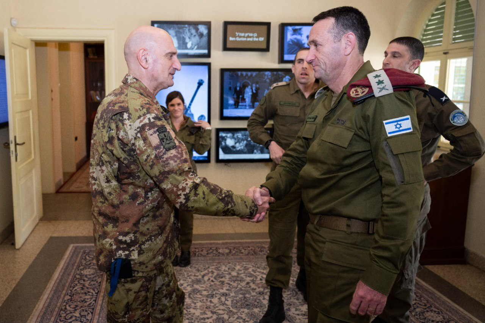

## Message 13233

דובר צה"ל:

הרמטכ"ל נפגש עם ראש מטה ההגנה של איטליה

הרמטכ"ל, רב-אלוף הרצי הלוי, אירח השבוע (ב') את ראש מטה ההגנה של איטליה, גנרל (****) לוסיאנו פורטולנו כאורחו הרשמי. 

השניים שוחחו על האירועים המבצעיים האחרונים ותמונת המצב הבטחונית, בדגש על הפעילות בלבנון. בנוסף, שוחחו על חשיבות הבטחת ביטחונם של אנשי האו"ם המועסקים במשימת יוניפי"ל, הפועלים תחת החלטה 1701 של מועצת הביטחון של האו"ם. 

הרמטכ״ל הביע את הערכתו לקשר בין הצבאות, והתייחס לכך שצה"ל ימשיך להעמיק את היחסים המקצועיים עם צבא איטליה מתוך מחויבות משותפת לחיזוק היציבות האזורית והביטחון במזרח התיכון.

