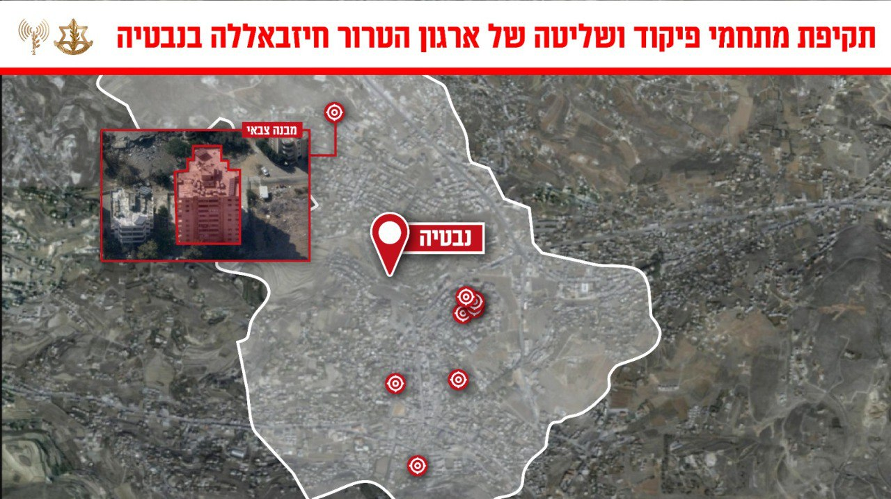

## Message 13250

דובר צה"ל:

צה״ל תקף מתחמי פיקוד ושליטה ותשתיות טרור של חיזבאללה בבעלבכ ובנבטיה

מוקדם יותר היום מטוסי קרב של חיל האוויר, בהכוונת אגף המודיעין ופיקוד הצפון תקפו מספר מתחמי פיקוד ושליטה ותשתיות טרור נוספות של ארגון הטרור חיזבאללה במרחב בעלבכ שבעומק לבנון ובמרחב נבטיה שבדרום לבנון. 

ארגון הטרור חיזבאללה משתלט באופן שיטתי על מרחבים אזרחיים ברחבי מדינת לבנון, על מנת לבצע פעולות ומתווי טרור, תוך הטמעת פעיליו ומפקדיו במרחב האזרחי. פעילות זו פוגעת ומסכנת את אזרחי מדינת לבנון. 

טרם התקיפות ננקטו צעדים רבים על מנת לצמצם את האפשרות לפגיעה באזרחים, הכוללים אזהרות רבות בפלטפורמות שונות לאוכלוסייה באזור. 

תקיפות אלו מהוות חלק נוסף במאמץ של צה״ל לפגוע בפעילות הצבאית של ארגון הטרור חיזבאללה ולהקשות על הארגון לשקם את יכולותיו הצבאיות.

