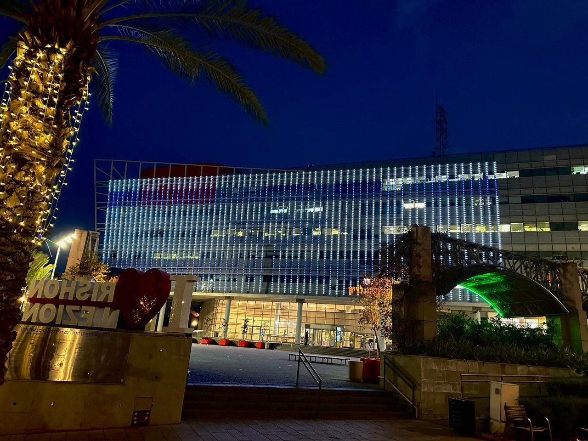

## Message 13252

דובר צה"ל:

מצדיעים לפצועי ונכי צה״ל ממלחמת ״חרבות ברזל״: עשרות רשויות ברחבי הארץ האירו הערב באור כחול-לבן מבנים מרכזיים לכבוד שבוע ההצדעה לפצועי המלחמה

מתחילת מלחמת ״חרבות ברזל״, נוספו מאות חיילים וחיילות למערך הנפגעים של צה״ל, לאחר שהגנו בגופם על מדינת ישראל. 

במסגרת שבוע ההצדעה לפצועי ונכי צה״ל מהמלחמה, הערב (ד׳) מעל ל-50 רשויות ברחבי הארץ האירו מבנים מרכזיים בצבעים כחול ולבן, כאות תודה והערכה לפצועי ונכי צה״ל מהמלחמה.

