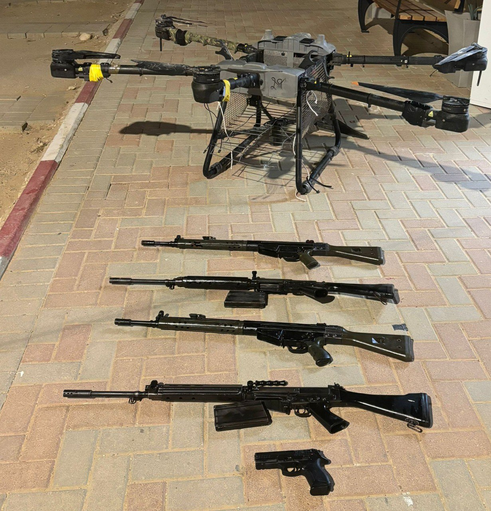

## Message 13294

דובר צה"ל:

סוכלה הברחת אמצעי לחימה במרחב גבול מצרים

כוחות צה"ל זיהו אמש (ד') רחפן שחצה משטח מצרים לשטח ישראל במרחב חטיבת פארן. 
הרחפן הופל, כוח צה"ל שקפץ לנקודה איתר עליו ארבעה רובים ואקדח. 
אמצעי הלחימה שאותרו הועברו לטיפול כוחות הביטחון.

