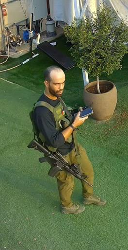

## Message 11238

הודעה משותפת לדובר צה"ל ודוברות שב"כ:

צה"ל ושב"כ חיסלו את מפקד פלוגת הנוח'בה שפיקד על הטבח ביישוב נתיב העשרה ב-7 באוקטובר

מטוסי קרב של חיל האוויר תקפו בהכוונת שב"כ ואוגדת עזה, מתחם ששימש מחבלים בארגון הטרור חמאס, בסמוך לבית החולים 'אל-אהלי' בעיר עזה. 

בתקיפה חוסלו שמונה מחבלי חמאס מגדוד דרג׳ תופאח, בהם אחמד פוזי נאצר מוחמד ואדיה, מפקד פלוגת הנוח׳בה בגדוד ופעיל במערך מצנחי הרחיפה של חמאס. ב-7 באוקטובר פשט ואדיה לנתיב העשרה באמצעות מצנח רחיפה ופיקד על הטבח ביישוב. 

ואדיה הוא המחבל ששתה קולה בתוך בית משפחת תעסה, לנגד עיניהם של ילדיו של גיל תעסה ז"ל ששרדו את הטבח, לאחר שאביהם נרצח בידי המחבלים.

בתקיפה חוסל מחבל נוסף שעסק בהתמחויות קרביות בתחום ההנדסה, צליפה ונ"ט, והיה אחראי על אספקת המטענים לפיצוץ הגדר בגזרת הגדוד במתקפת הטרור ב-7 באוקטובר.

תקיפת המחבלים בוצעה מחוץ לבית החולים. טרם התקיפה ננקטו צעדים בכדי לצמצם את הסיכוי לפגיעה באזרחים, לרבות שימוש בחימוש מותאם לסוג התקיפה, חוזי מדויק ומידע מודיעיני נוסף.

