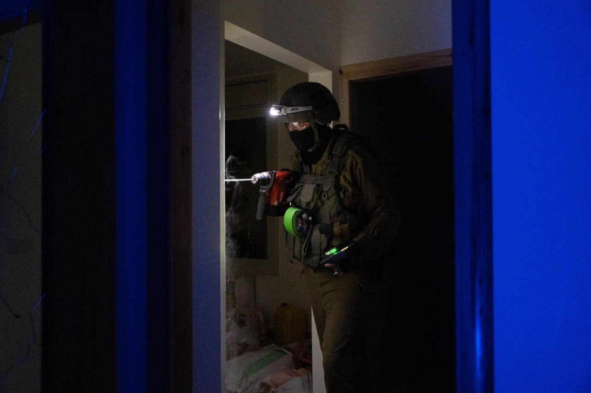

## Message 11243

דובר צה״ל:

כוחות צה״ל מיפו את ביתו של המחבל שביצע את פיגוע הירי ביום ראשון במרחב תרקומיא 

כוחות הנדסה של חטיבת יהודה יחד עם גדוד 941 פעלו הלילה (ב'), בכפר אידנא שבחטיבת יהודה, למיפוי ביתו של המחבל שביצע את פיגוע הירי ביום ראשון במרחב תרקומיא, בו נהרגו רס"ם רוני שקורי ז"ל, רנ"ג הדס ברנץ ז"ל ופקד אריק בן אליהו ז"ל. המיפוי בוצע לקראת הריסת בית המחבל.

