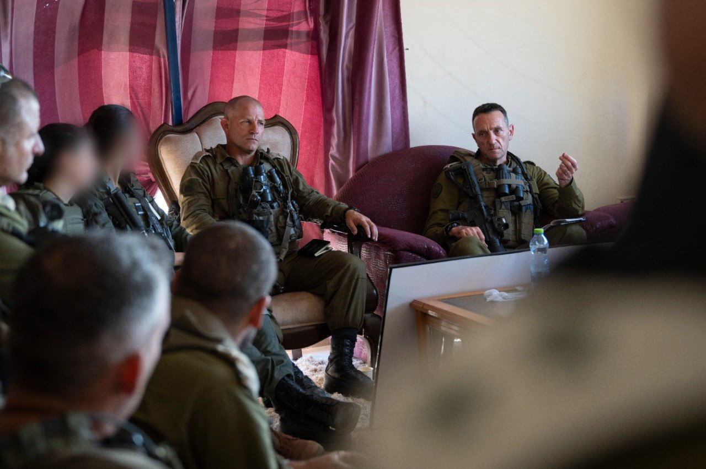

## Message 11268

דובר צה"ל: 

הרמטכ"ל ברצועת עזה: "אסור לוותר על אף אחת ממטרות המלחמה"

הרמטכ"ל, רב-אלוף הרצי הלוי, קיים אתמול (ג') הערכת מצב במרכז רצועת עזה ואמר "אסור לוותר על אף אחת ממטרות המלחמה. צה"ל ממשיך להכריע את הזרוע הצבאית של חמאס ועושה הכל כדי להביא את החטופים בחיים. כל חטוף שנחזיר עכשיו בחיים יהיו לו עוד שנים רבות, וכל מחבל בסוף יחוסל". 

בביקור השתתפו מפקד פיקוד הדרום, אלוף ירון פינקלמן, מפקד אוגדה 252, תת-אלוף יהודה ואך ומפקדים נוספים.

