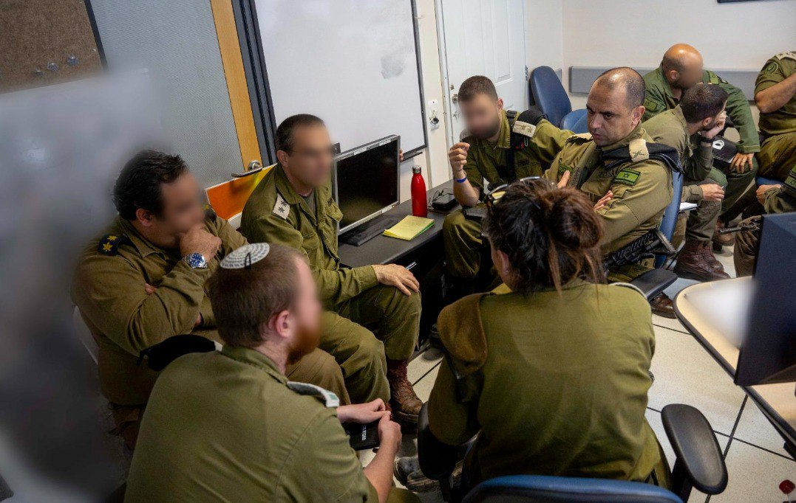

## Message 11274

דובר צה"ל:

אתמול (ג') התקיים תרגיל היערכות בראשות מפקד פיקוד הצפון, אלוף אורי גורדין ומפקד הגיס הצפוני, אלוף סער צור ובהשתתפות מפקדי אוגדות, קציני מטה ומפקדים נוספים.

במסגרת התרגיל התקיים דיון אודות התרחישים השונים בראי התפתחות הלחימה בזירה הצפונית והמענה המבצעי הניתן לכל תרחיש. כמו כן, ניתנה תמונת המצב הנוכחית ונעשתה למידה משותפת על מנת לחזק ולשמר את ההיערכות והמוכנות לתוכנית ההתקפה בזירה הצפונית.

