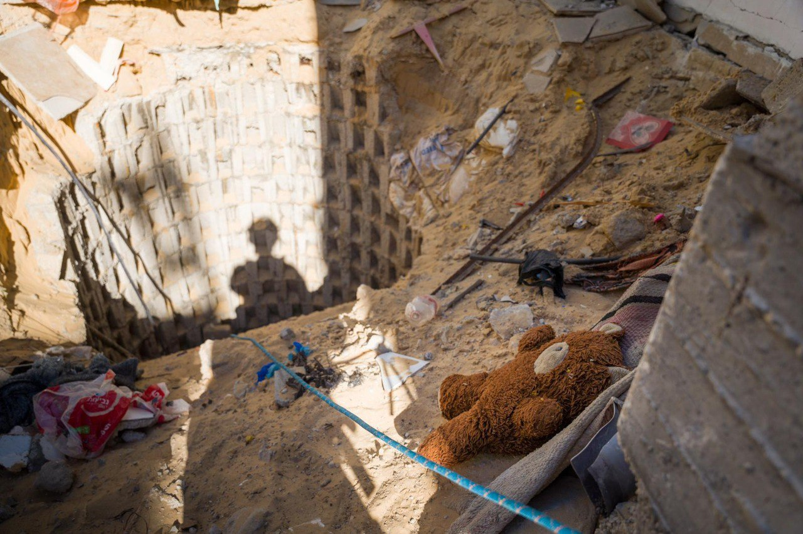

## Message 11278

דובר צה"ל:

לצד בובות וציורי קיר בחצר ילדים: המנהרה בה אותרו גופות החטופים

הפיר שמוביל למנהרה בה אותרו גופותיהם של החטופים כרמל גת ז"ל, עדן ירושלמי ז"ל, הירש גולדברג-פולין ז"ל, אלכסנדר לובנוב ז"ל, אלמוג סרוסי ז"ל ורס"ר אורי דנינו ז"ל, אותר לצד בובות וציורי קיר של דמויות מצוירות בחצר ילדים. 

כוחות אוגדה 162 ושב"כ איתרו את הפיר שמוביל למנהרה במרחב מוקף אויב ורווי מלכודים. זוהי דוגמה נוספת לשימוש הציני של חמאס במרחב האזרחי לשם פעילות טרור.

