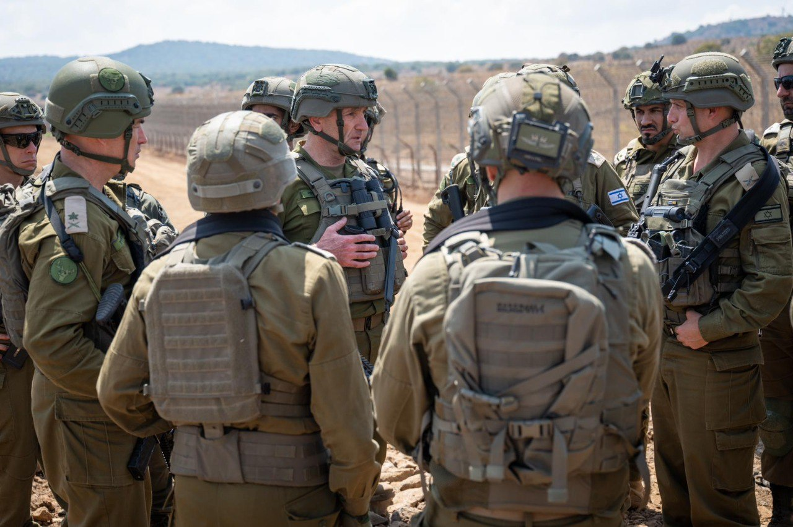

## Message 11313

דובר צה"ל:

הרמטכ"ל בגבול הצפון: צה״ל ממוקד בלחימה בחיזבאללה, ומתכונן למהלכים התקפיים בתוך השטח

הרמטכ״ל, רב-אלוף הרצי הלוי, קיים היום (ו׳) הערכת מצב וסיור באוגדה 210 בגבול רמת הגולן עם מפקד פיקוד הצפון, אלוף אורי גורדין, מפקד אוגדה 210, תת-אלוף יאיר פלאי ומפקדים נוספים. 

מפקדי האוגדה הציגו את ההיערכות המחודשת בגבול בפעולות התקפיות והגנתיות, בהן עיבוי המכשול ההנדסי ומרכיבי האיסוף.

מצורפים דבריו המלאים של הרמטכ״ל: "צה״ל ממוקד מאוד בלחימה בחיזבאללה, אני חושב שכמות התקיפות בחודש האחרון, פעילים שנהרגו, רקטות שהושמדו, תשתיות שהושמדו, היא רבה מאוד. פיקוד צפון, עם כל היכולות של צה״ל, תוקף בתוך לבנון הרבה מהיכולות של חיזבאללה לפני שהן תוקפות אותנו, ואנחנו במקביל מתכוננים גם למהלכים התקפיים בתוך השטח. אני חושב שהשילוב הזה, של תקיפות מאוד משמעותיות על חיזבאללה, כדי להקטין את האיומים שישנם על התושבים בצפון, גם ברמת הגולן, מאוד מאוד משמעותי, והמוכנות להתקפה קדימה, שאנחנו עוסקים בה הרבה".

