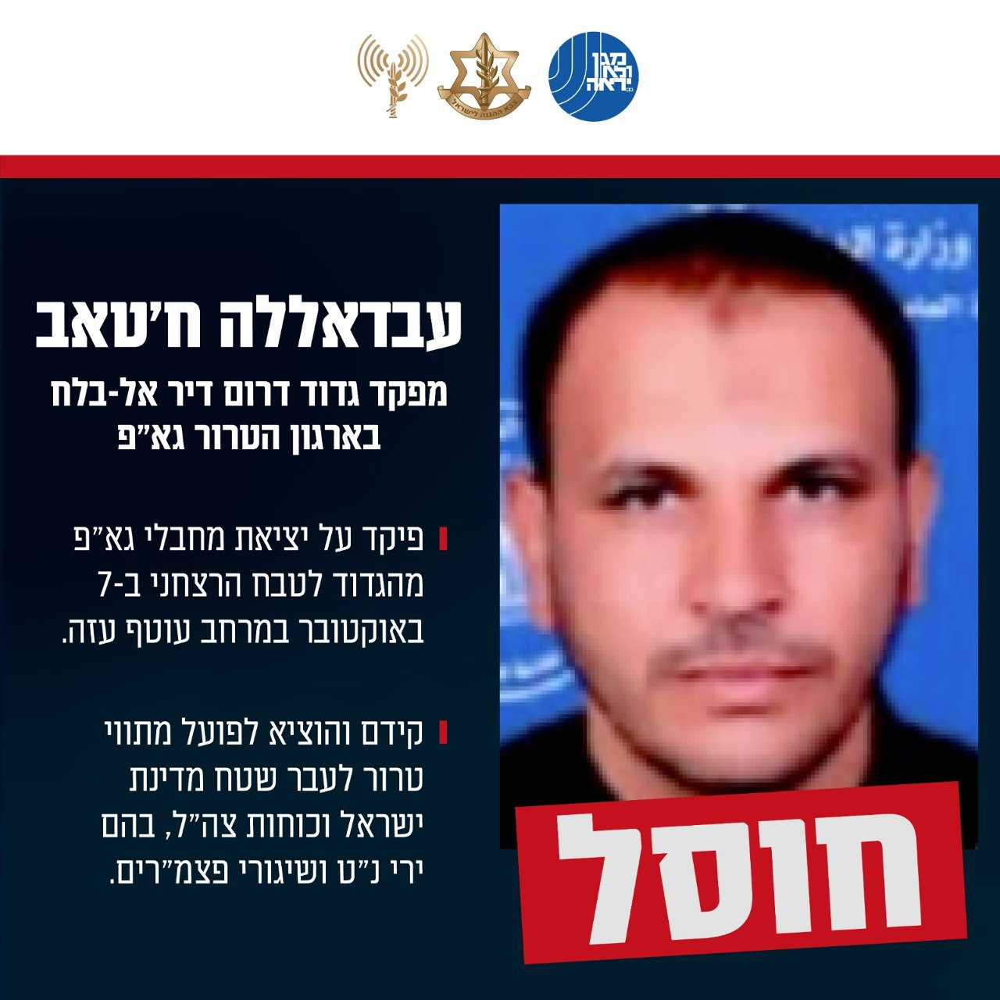

## Message 11330

הודעה משותפת לדובר צה"ל ודוברות שב"כ:

צה"ל ושב"כ חיסלו שני מפקדי גדודים של ארגון הטרור גא"פ

מסוקי קרב של חיל האוויר תקפו שלשום (ה'), בהכוונת שב״כ, אמ"ן ופיקוד הדרום, להסרת איום מיידי, מתחם פיקוד ושליטה שהוסווה בתוך המתחם ההומניטרי בדיר אל-בלח ושימש מחבלים מארגוני הטרור חמאס וגא"פ.

בתקיפה חוסלו מספר מחבלים מארגוני הטרור, ביניהם: 
המחבל עבדאללה ח'טאב, מפקד גדוד דרום דיר אל-בלח בארגון הטרור גא"פ, אשר פיקד על יציאת מחבלי גא"פ מהגדוד לטבח הרצחני ב-7 באוקטובר במרחב עוטף עזה. 

המחבל קידם והוציא לפועל מתווי טרור לעבר שטח מדינת ישראל וכוחות צה"ל, בהם ירי נ״ט ושיגורי פצמ"רים.

בנוסף חוסל המחבל חאתם אבו אלג׳דיאן, מפקד גדוד מזרח דיר אל-בלח בארגון הטרור גא"פ, אשר קידם והוציא לפועל מתווי טרור נגד כוחות צה"ל במהלך המלחמה.

טרם התקיפה ננקטו צעדים רבים כדי לצמצם את הסיכוי לפגיעה באזרחים, לרבות שימוש בחימוש מדויק, חוזי מהאוויר ומידע מודיעיני נוסף. 

זוהי דוגמה נוספת לשימוש השיטתי של ארגוני הטרור ברצועה באוכלוסייה ובתשתיות אזרחיות, בהן המרחב ההומניטרי, לצורך ביצוע פעולות טרור נגד מדינת וכוחות צה"ל.

