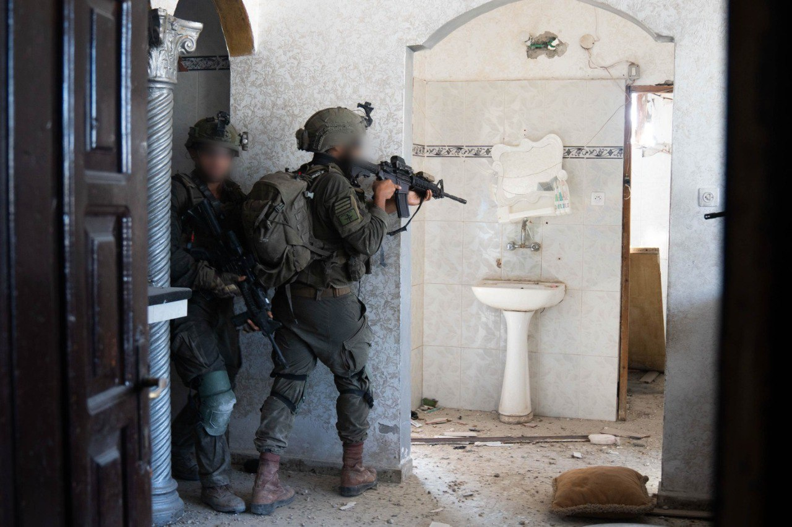

## Message 11344

דובר צה"ל:

כוחות צה"ל ממשיכים בלחימה בדרום ומרכז רצועת עזה; חוסל מפקד יחידת הרקטות בגדוד מזרח חאן יונס של ארגון הטרור חמאס

כוחות אוגדה 162 ממשיכים לפעול במרחב רפיח, חיסלו מחבלים, פשטו על תשתיות טרור ואיתרו אמצעי לחימה רבים במרחב.

בנוסף, כלי טיס של חיל האוויר בהכוונת פיקוד הדרום חיסל ביום שלישי (ג') את המחבל, ראא'ף עומר שלמאן אבו שאב, מפקד יחידת הרקטות בגדוד מזרח חאן יונס. ראא'ף אחראי על שיגור מטחי רקטות לעוטף ולמרכז, ממרחב חאן יונס, מתחילת המלחמה.

כוחות אוגדה 252 ממשיכים בלחימה במרכז הרצועה ובמהלך היממה האחרונה הכוחות חיסלו מספר מחבלים שהיוו איום על הכוחות.

במהלך היממה האחרונה מטוסי קרב וכלי טיס של חיל האוויר תקפו כ- 25 מטרות של ארגון הטרור חמאס ברחבי רצועת עזה, בין המטרות שהותקפו חוליות מחבלים, מבנים צבאיים ותשתיות צבאיות.

