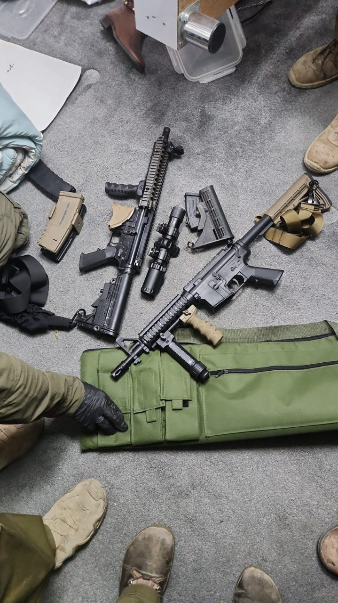

## Message 11365

דובר צה"ל:

במהלך הלילה כוחות צה"ל, שב"כ ומג"ב פעלו ברחבי יהודה ושומרון לסיכול טרור.
במהלך הפעילות באבו שחידם ובקלנדיה שבחטיבת בנימין, הכוחות עצרו מבוקש, איתרו והחרימו אמצעי לחימה בהם רובים מסוג "M16", תחמושת, חלקי נשק, ציוד צבאי ועוד.

בדיר אבו משעל ובבאקה שבמרחב חטיבת אפרים הכוחות עצרו שני מבוקשים ובחברון שבחטיבת יהודה נעצר מבוקש ואותרה תחמושת.
אין נפגעים לכוחותינו.

