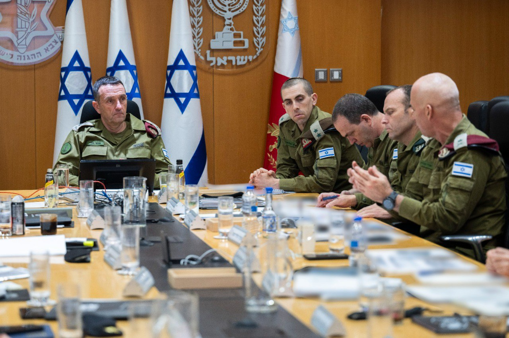

## Message 11370

דובר צה"ל:

הרמטכ"ל, רב-אלוף הרצי הלוי, סיים לפני זמן קצר הערכת מצב לגזרה הצפונית עם חברי פורום המטה הכללי, והתייחס לאירוע הבוקר בו כטב"ם פגע בבניין בנהריה. 

הרמטכ"ל אמר: "הפגיעה של חיזבאללה בבניין מגורים הבוקר בנהריה היא אירוע חמור, כך גם הירי לעבר אזרחי הצפון. צה"ל פועל בצפון בעוצמה, ונמצא במוכנות גבוהה עם תוכניות מבצעיות מוכנות, ערוך לכל משימה אליה יידרש".

