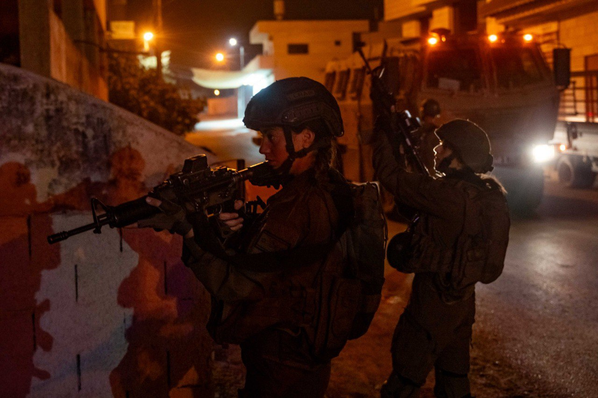

## Message 11381

דובר צה"ל:

כוחות צה״ל מיפו הלילה את ביתו של המחבל שביצע פיגוע מטען בתל אביב ב-18.8.2024; כוחות הביטחון פעלו הלילה למעצר 16 מבוקשים ברחבי יהודה ושומרון

כוחות צה״ל פעלו הלילה (ב'), בשכם שבחטיבת שומרון למיפוי ביתו של המחבל שביצע את פיגוע המטען בתל אביב לפני כחודש.
המיפוי בוצע על מנת לבחון את אפשרות הריסתו.

בנוסף, כוחות הביטחון פעלו הלילה למעצר 16 מבוקשים ברחבי יהודה ושומרון. בכפר עקב בבנימין נעצרו ארבעה מבוקשים ואותרו והוחרמו תחמושת וציוד צבאי. 
בבני נעים שביהודה לוחמי יחידת דובדבן עצרו שני מבוקשים, ואיתרו והחרימו רובה מסוג M16.

במרחב אל-ערוב שבעציון, כוחות צה״ל ירו ופגעו במחבל שהשליך בקבוקי תבערה לעבר הכוחות, אין נפגעים לכוחותינו.

