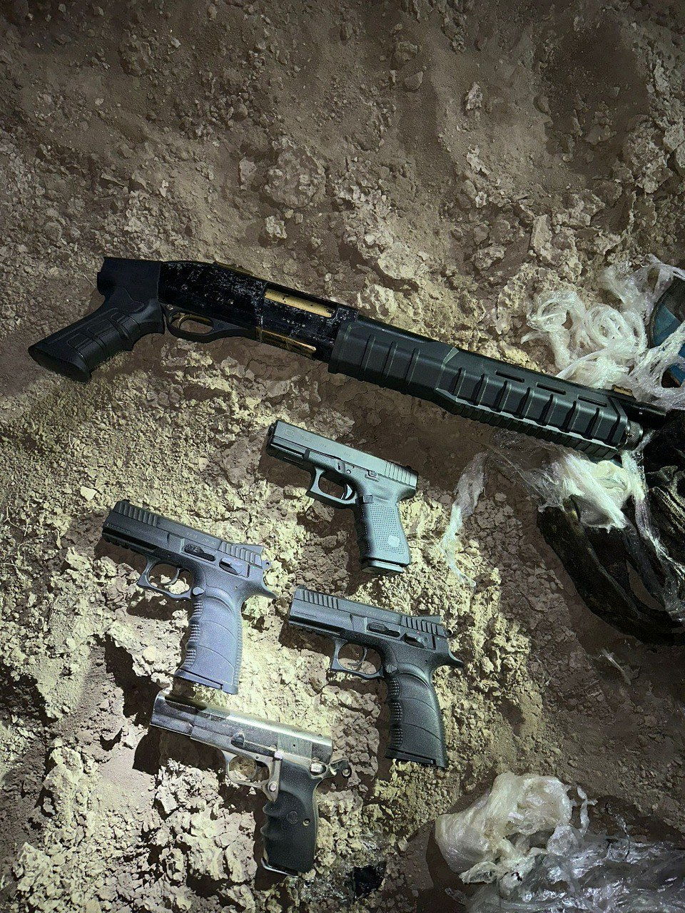

## Message 11391

דובר צה"ל:

כוחות צה"ל ומשטרה סיכלו הברחת אמצעי לחימה במרחב חטיבת הבקעה והעמקים

בפעילות משותפת אמש (ב'), של חטיבת הבקעה והעמקים ומשטרת ישראל, זוהתה תנועה חשודה סמוך למושב נערן. 
תצפיתניות של יחידה 636 זיהו את ניסיון ההברחה, הכווינו כוחות לנקודה, אשר איתרו ארבעה אקדחים ונשק ארוך.

כלי הנשק הועברו להמשך טיפול משטרת ישראל.

