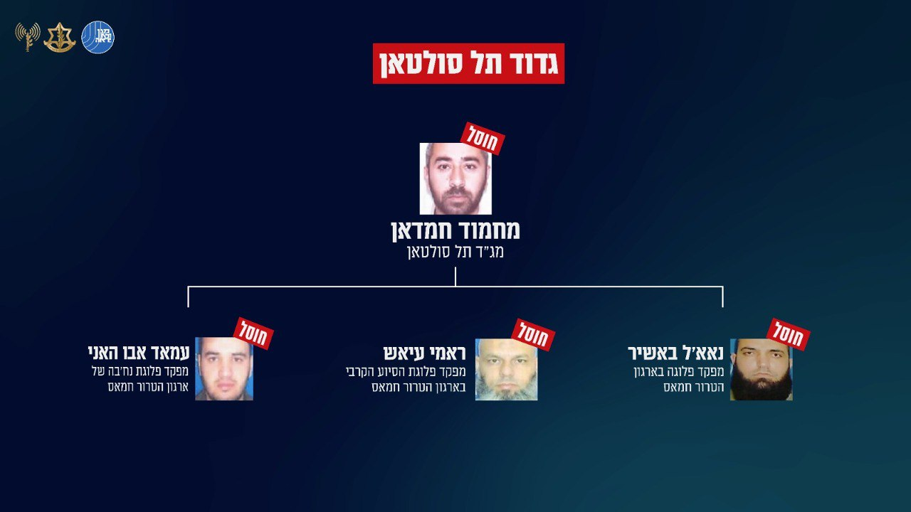

## Message 11393

הודעה משותפת לדובר צה"ל ודוברות שב"כ:

חוסלה שדרת הפיקוד של גדוד 'תל סולטאן': כוחות אוגדה 162 ושב"כ חיסלו את מפקד הגדוד ושלושה מפקדי פלוגות

בפעילות משותפת של כוחות צה"ל ושב"כ, לוחמי חטיבה 401 זיהו באמצעות רחפנים מספר חוליות מחבלים, הכוחות הכווינו כלי טיס של חיל האוויר שחיסלו את המחבלים. בתקיפה חוסל מפקד גדוד 'תל סולטאן' מחמוד חמדאן ושלושה מפקדי פלוגות נוספים מהגדוד.

בתקיפה ובתקיפות נוספות חוסלה שרשרת הפיקוד של גדוד 'תל סולטאן' וכן, עשרות מחבלים נוספים מהגדוד. 

מפקד גדוד 'תל סולטאן' מחמוד חמדאן, לקח חלק משמעותי בתכנון הפשיטה לארץ ב-7 באוקטובר וקידם את תוכנית ההיערכות של חטיבת רפיח טרם כניסת כוחות צה״ל למרחב. בנוסף, יזם, הוביל ותכנן עשרות מתווי טרור נגד כוחות צה"ל ומדינת ישראל.

