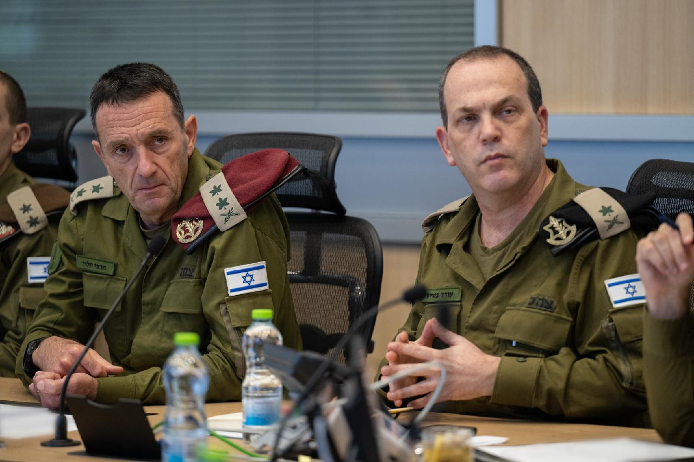

## Message 11542

דובר צה"ל:

הרמטכ"ל, רב-אלוף הרצי הלוי, קיים הערב הערכת מצב, בהשתתפות פורום המטה הכללי, בדגש על המוכנות בהתקפה ובהגנה בכלל הזירות.

דובר צה"ל מבקש להבהיר כי בשלב זה אין שינוי בהנחיות פיקוד העורף. יש להמשיך ולשמור על ערנות ודריכות, ועל כל שינוי במדיניות נעדכן באופן מידי.

