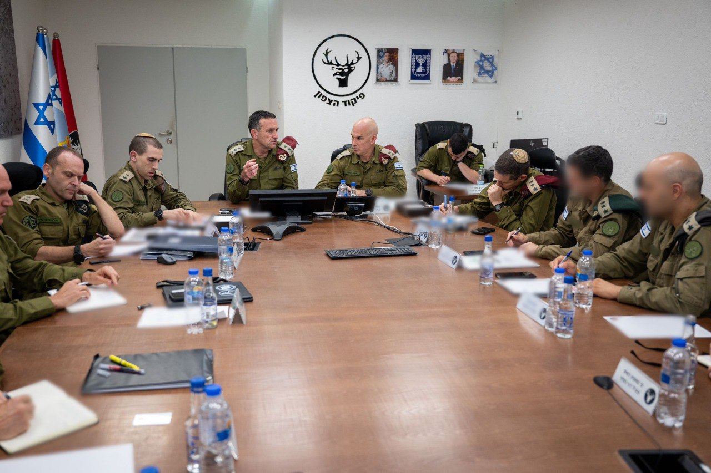

## Message 11556

דובר צה"ל:

הרמטכ"ל בפיקוד הצפון: יש לנו עוד הרבה יכולות, בכל שלב שאנחנו פועלים אנחנו מוכנים כבר שני שלבים קדימה 

הרמטכ"ל, רב-אלוף הרצי הלוי, קיים היום (ד׳) הערכת מצב בפיקוד הצפון עם חברי פורום המטה הכללי, ואישר את תוכניות ההתקפה וההגנה לזירה הצפונית.

מצורפים דבריו המלאים של הרמטכ״ל: ״אנחנו מאוד נחושים לייצר את התנאים הביטחוניים שמחזירים את התושבים לבתים, ליישובים, ברמת ביטחון גבוהה, ואנחנו מוכנים לעשות באמת כל מה שנדרש כדי להביא את הדברים האלה. 
אנחנו כמעט שנה, לאורך כל המלחמה נלחמים בעזה, שתי מטרות מרכזיות, יש עוד, פירוק החמאס והשבת החטופים הרבה הישגים ויש לנו עוד הרבה ללכת קדימה. 
יש לנו הרבה יכולות שעוד לא הפעלנו, עוד לא הפעלנו, ראינו פה חלק מהדברים, זה נראה לי במוכנות טובה ואנחנו מכינים את התוכניות האלה קדימה. הכלל הוא כל פעם שאנחנו עובדים בשלב מסוים שני השלבים הבאים מוכנים לצאת כבר חזק קדימה, בכל שלב המחיר בחיזבאללה צריך להיות גבוה״.

