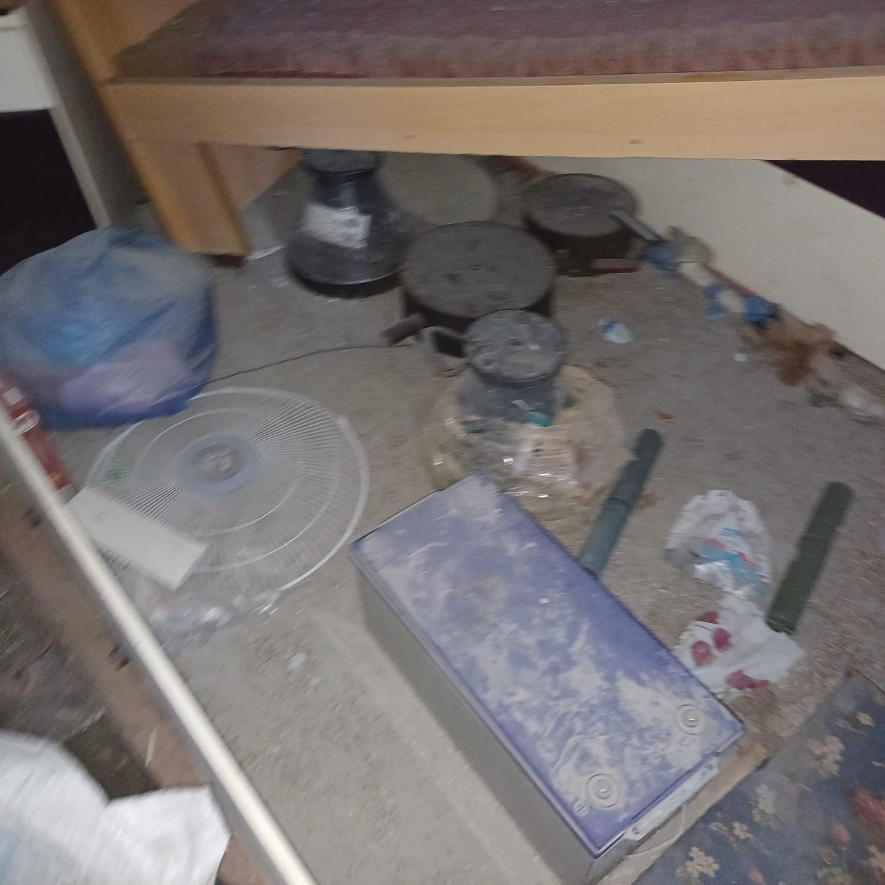

## Message 11566

דובר צה"ל:

פעילות כוחות 401 בתל סולטאן: למעלה מ-300 מחבלים חוסלו ומחסן מצבור רקטות לטווח ארוך שהושמד

כוחות חטיבה 401 פעלו בחודש האחרון בשכונת תל סולטאן ברפיח בפיקוד אוגדה 162. בפעילות במרחב חיסלו הכוחות למעלה מ-300 מחבלים ואת מרבית שרשרת הפיקוד של גדוד תל סולטאן.

בנוסף, אותר והושמד מחסן רקטות ארוכות טווח של האויב ומחסני אמל"ח ובהם רובי צלפים, מחסניות, טילי נ"ט ורימונים.

בפעילות המבצעית השבוע במרחב, נפלו סרן דניאל מימון טואף ז״ל, סמ״ר אגם נעים ז״ל, סמ״ר עמית באכרי ז״ל וסמ״ר דותן שמעון ז״ל. צה"ל משתתף בצער המשפחות וימשיך ללוותן.

