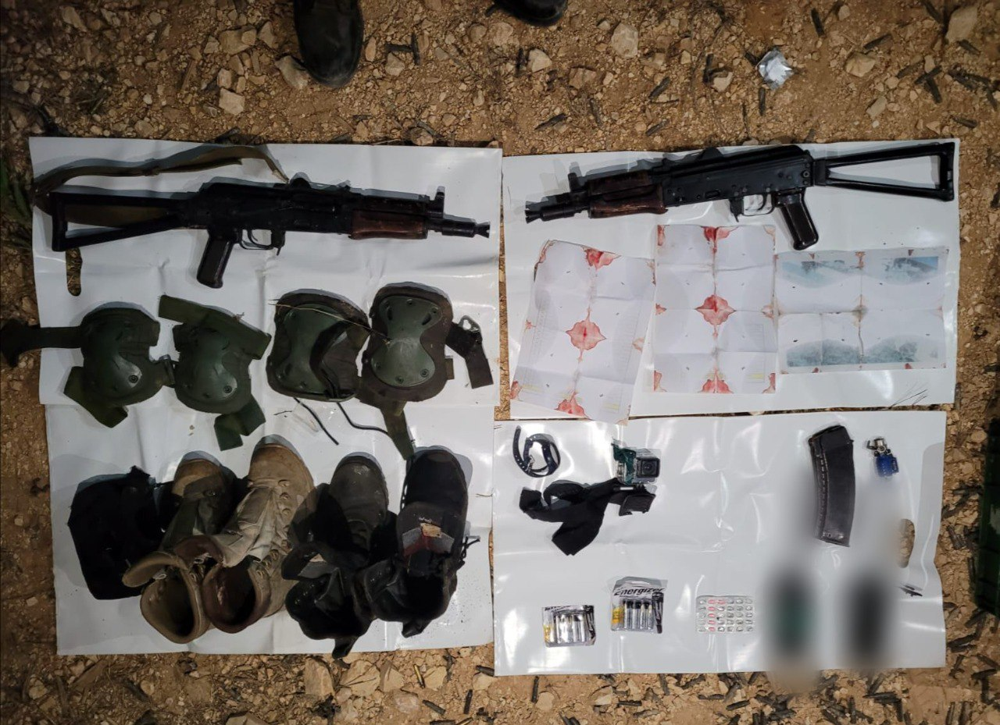

## Message 11578

דובר צה"ל:

צה"ל סיכל ניסיון פיגוע מטען בגבול לבנון: תיעוד ממצלמות הגוף של המחבלים שחוסלו

כוחות צה״ל שהיו בפעילות מארב בגבול הצפון בתחילת השבוע (ב'), זיהו חשודים במרחב הגבול עם לבנון. כוחות גולני ואגוז הכווינו ירי ארטילרי וכלי טיס, וחיסלו שני מחבלים שניסו לבצע פיגוע מטען במרחב מוצב ׳ציפורן׳.

