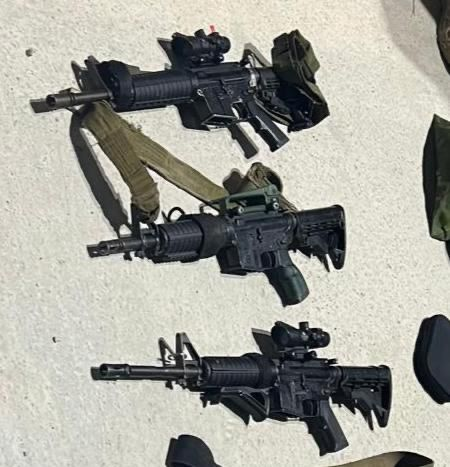

## Message 11606

הודעה משותפת לדובר צה"ל ודוברות שב"כ: 

צה"ל ושב"כ חיסלו את ראש התארגנות הטרור בקבטיה ושישה מחבלים נוספים במבצע בצפון השומרון

במהלך פעילות משותפת של צה"ל ושב"כ אתמול (ה׳) בקבטיה שבמרחב ג'נין, לוחמי יחידת דובדבן חיסלו ארבעה מחבלים חמושים במהלך חילופי אש. 
הכוחות החרימו שלושה נשקים ואמצעי לחימה נוספים שאותרו על המחבלים שחוסלו. 

בנוסף, במרחב זוהו אמש מספר מחבלים חמושים שירו לעבר הכוחות שפעלו במרחב. 
בהכוונת שב"כ והכוחות בשטח, כלי טיס של חיל האוויר תקף את הרכב בו היו המחבלים וחיסל שלושה מהם. ברכב של המחבלים היו אמצעי לחימה וחומרי נפץ שגרמו לפיצוץ משנה. 

בין המחבלים שחוסלו בתקיפה, ראש התארגנות הטרור בקבטיה, שאדי זכארנה, אשר אחראי על הכוונה והוצאה לפועל של פיגועים במרחב צפון השומרון. 

במהלך הפעילות, הכוחות עצרו שבעה מבוקשים החשודים בביצוע פעולות טרור.

