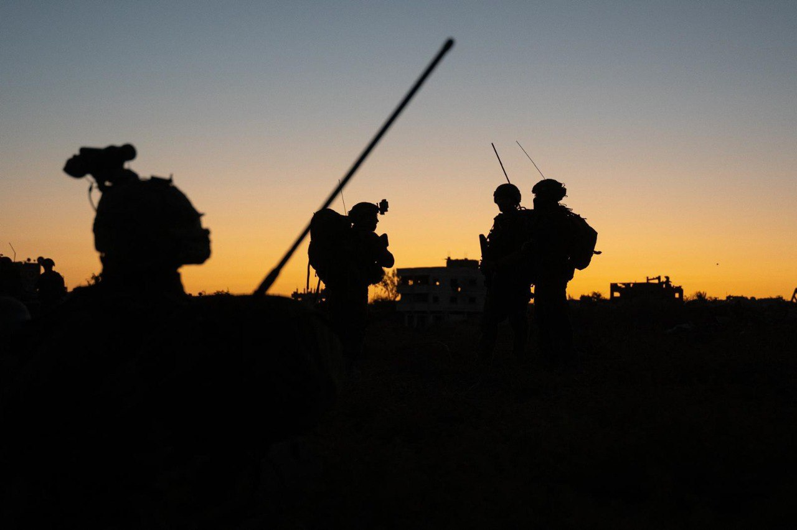

## Message 11622

דובר צה"ל:

צה"ל ממשיך לתקוף עשרות תשתיות טרור ברצועת עזה; אוגדה 162 ואוגדה 252 חיסלו מחבלים במרכז ובדרום הרצועה

בהכוונת מידע מודיעיני של אמ"ן ופיקוד הדרום, חוסל המחבל מחמד מנצור, שהיווה מוקד ידע טכנולוגי משמעותי במודיעין הצבאי של ארגון הטרור חמאס. בנוסף, חוסלו מספר מחבלים נוספים מארגון הטרור חמאס אשר הוציאו מתווי טרור כנגד כוחות צה"ל.

צוותי הקרב של חטיבת גבעתי והנח"ל, ממשיכים להילחם בדרום רצועת עזה. לאורך היממה האחרונה, הכוחות איתרו אמצעי לחימה, חיסלו מספר מחבלים חמושים ותקפו תשתיות טרור רבות במרחב.

צוותי הקרב של חטיבה 5 ו-'המחץ' (14), ממשיכים לפעול במרכז רצועת עזה. הכוחות חיסלו מספר מחבלים. בנוסף, בהכוונת הכוחות, כלי טיס תקף מספר מבנים צבאיים של ארגון הטרור חמאס במרחב.

חיל האוויר תקף ביממה האחרונה כ-20 מטרות טרור באמצעות מטוסי קרב וכלי טיס ברחבי רצועת עזה, בין המטרות שהותקפו, תשתיות טרור, מבנים צבאיים וחוליות מחבלים.

