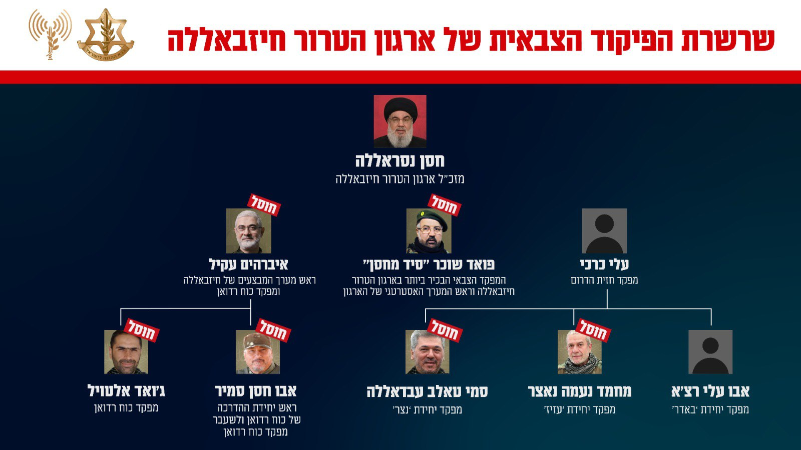

## Message 11632

דובר צה"ל:

מתחת לאדמה ובלב מעוז חיזבאללה בביירות: צה"ל חיסל את צמרת מפקדי ׳כוח רדואן׳ בארגון הטרור חיזבאללה

בתקיפה מדוייקת אמש (ו׳) מטוסי קרב של חיל האוויר, בהכוונה מודיעינית של אגף המודיעין, תקפו וחיסלו  את ראש מערך המבצעים ומפקד כוח רדואן של ארגון הטרור חיזבאללה, איבראהים עקיל, במהלך פגישה עם מפקדים מכוח רדואן בשכונת הדאחייה. 

בנוסף לעקיל חוסלו בתקיפה 15 מחבלים נוספים בארגון הטרור חיזבאללה, ביניהם מפקדים בכירים בשרשרת הפיקוד של ׳כוח רדואן׳.

בין המחבלים שחוסלו אחמד מחמוד והבי (אבו חסין סמיר) אשר שימש כראש יחידת ההדרכה בכוח רדואן. מילא שורה של תפקידים בארגון הטרור ושימש כמפקד כוח רדואן בעשור האחרון עד תחילת 2024. היה ממתכנני ומובילי תוכנית ההתקפה ״כיבוש הגליל״, והיה שותף לקידום ההתבססות של חיזבאללה בדרום לבנון, תוך נסיונות לשיפור יכולות הלחימה הקרקעיות של הארגון. לאורך השנים, ובמהלך החודשים הראשונים של המלחמה, והבי תכנן והוציא לפועל פיגועי חדירה וירי רבים לשטח מדינת ישראל.

