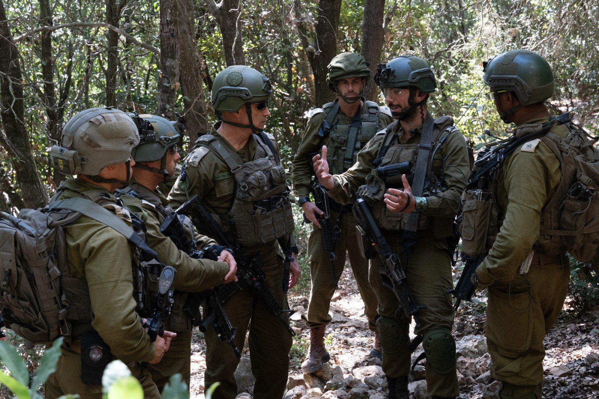

## Message 11641

דובר צה"ל:

כחלק מהרחבת הלחימה: מפקדי פיקוד הצפון קיימו הערכות מצב בגבול לבנון

מפקד פיקוד הצפון, אלוף אורי גורדין, קיים היום (ש׳) הערכת מצב וסיור בחטיבה 300 ובחטיבה 769 עם מפקדי החטיבות ומפקדים נוספים.

בנוסף, בימים האחרונים ביצעו מפקדי האוגדות והחטיבות של פיקוד הצפון הערכות מצב וסיורים נוספים במרחב כחלק מההיערכות להרחבת הלחימה בגזרה.

