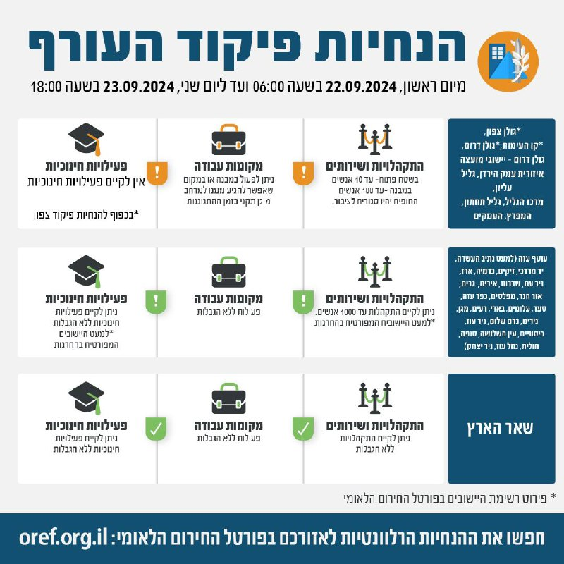

## Message 11655

דובר צה"ל:

שינויים במדיניות ההתגוננות של פיקוד העורף

בתום הערכת מצב הוחלט כי החל מהבוקר (א׳) בשעה 06:00, יתעדכנו הנחיות ההתגוננות של פיקוד העורף באזורי ההנחיה גולן צפון, קו העימות, גולן דרום, גליל עליון, מרכז הגליל, גליל תחתון, המפרץ והעמקים.

במרחבי הנחייה גולן צפון, קו העימות, גולן דרום (למעט יישובי מוא"ז עמק הירדן) - בכפוף להנחיות פיקוד צפון. 

יש להמשיך ולעקוב אחר ההנחיות המפורסמות על ידי פיקוד העורף באמצעי ההפצה הרשמיים. 
ההנחיות המלאות מעודכנות בפורטל החירום הלאומי וביישומון פיקוד העורף.

