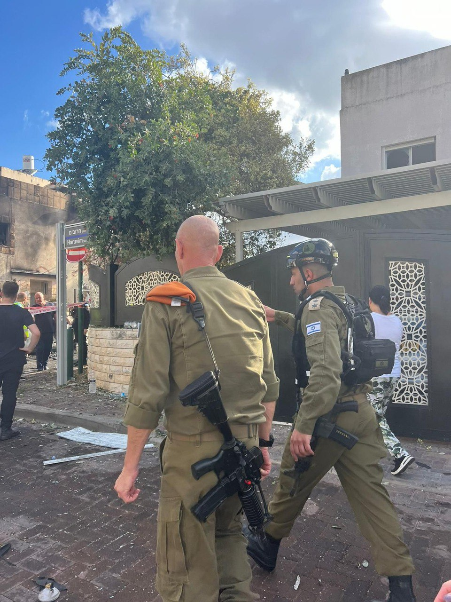

## Message 11659

דובר צה״ל: 

מפקד פיקוד העורף, אלוף רפי מילוא, נמצא בשעה זו בזירת הנפילה בקריית ביאליק. 

כוחות פיקוד העורף קפצו לזירה באופן מיידי והתחילו לבצע סריקות במקום, תוך שיתוף פעולה עם משטרת ישראל, כב״ה, מד״א והרשות המקומית. אין נפגעים באירוע.

נדגיש כי יש להמשיך לעקוב אחר ההנחיות המתפרסמות על ידי פיקוד העורף באמצעי ההפצה הרשמיים - הן מצילות חיים.

