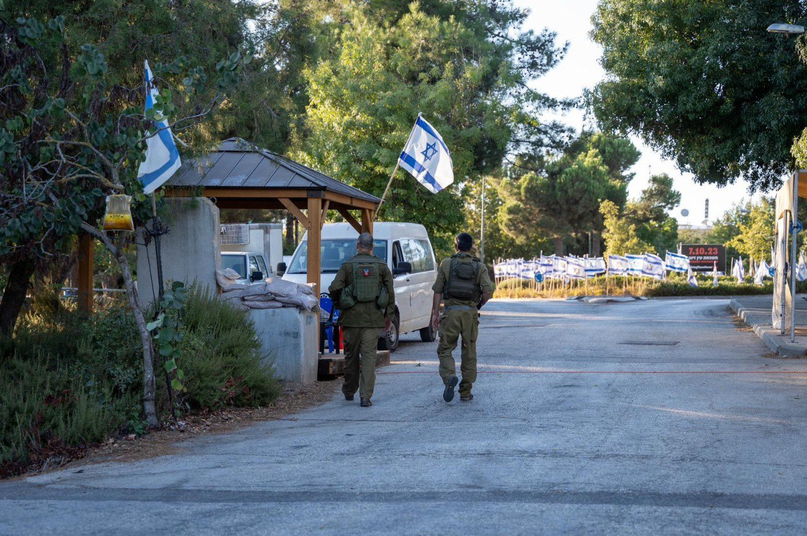

## Message 11667

דובר צה"ל:

מפקד פיקוד הצפון לראשי רשויות: ״פגענו משמעותית בחיזבאללה ואנחנו נמשיך ונעמיק את הפגיעה. אנחנו בנקודה של השתנות״

מפקד פיקוד הצפון, אלוף אורי גורדין, נפגש אתמול (ש׳) עם ראשי הרשויות בצפון. 
במסגרת הפגישה התקיים שיח עם ראשי הרשויות בו הוצגו עיקרי הערכת המצב עד כה ותהליכי ההיערכות לקראת הרחבת הלחימה בגזרה.

כמו כן, בימים האחרונים מפקדים בפיקוד הצפון קיימו שיח ודיונים אודות תמונת המצב העדכנית יחד עם ראשי הרשויות, רבש״צים וחברי כיתות הכוננות ביישובי הצפון. 

בנוסף, בוצעו אימונים מקיפים ביישובי קו המגע תוך העלאת המוכנות של כיתות הכוננות אשר פועלים בשיתוף פעולה עם צה״ל ומהווים חלק בלתי נפרד משמירה על ביטחון היישובים.

מדברי מפקד פיקוד הצפון, אלוף אורי גורדין: ״פגענו משמעותית בחיזבאללה ואנחנו נמשיך ונעמיק את הפגיעה. אנחנו בנקודה של השתנות. לצד משימת ההגנה אנחנו במוכנות גבוהה לתוכניות ההתקפה הנוספות על חיזבאללה. אני מלא הערכה לאופן בו אתם מובילים את הקהילות שלכם בימים מורכבים אלה. אנחנו נמשיך לפעול יחד איתכם, בחיבור ושיתוף פעולה מלא״.

