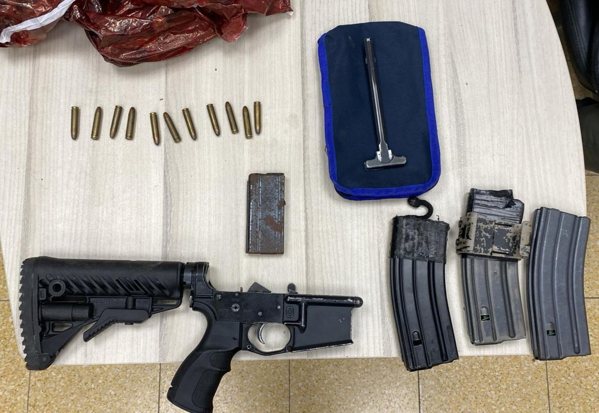

## Message 11717

דובר צה״ל:

 כ-100,000 ש"ח כספי טרור וארבע מחרטות הוחרמו במהלך פעילות כוחות צה"ל, שב"כ ומג"ב לסיכול טרור ברחבי יהודה ושומרון

במהלך הפעילות בחברון שבחטיבת יהודה, כוחות צה"ל, המנהל האזרחי ומשטרת ישראל החרימו ארבע מחרטות לייצור נשקים. 
ביטא שבגזרת החטיבה הוחרמו רובה מסוג 'קרלו' וחלקי נשק נוספים.

בענתא שבחטיבת בנימין בהכוונת שב״כ נעצר מבוקש והוחרמו כ-100,000 ש״ח כספי טרור, באל מועייר שבגזרת החטיבה נעצר מבוקש נוסף.
בפעילויות במרחב חטיבת הבקעה והעמקים כוחות הביטחון עצרו מבוקש ותחקרו חשודים רבים.

במרחב שיוח׳ שבחטיבת עציון הוחרמו חומרים המיועדים להכנת מטענים, בבית לחם, תקוע ועיזריה נעצרו שישה מבוקשים והוחרמו חלקי נשק, מחסניות ותחמושת.

המבוקשים שנעצרו הועברו להמשך חקירת כוחות הביטחון, אין נפגעים לכוחותינו.

עד כה נעצרו מתחילת המלחמה כ-5,261 מבוקשים ברחבי פיקוד המרכז, 2,070 מהם משויכים לארגון הטרור חמאס.

