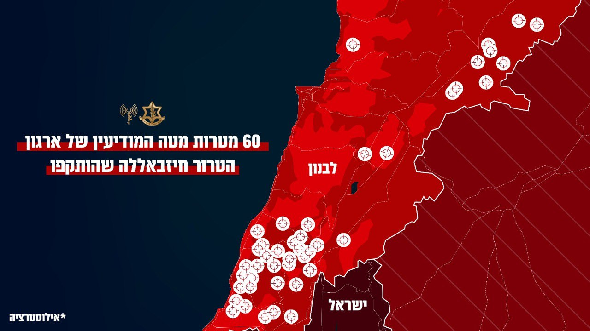

## Message 11793

דובר צה״ל:

צה״ל השלים תקיפות ב-60 יעדים של מטה המודיעין של חיזבאללה

מטוסי קרב תקפו היום (ד'), בהכוונת אגף המודיעין, 60 מטרות טרור של מטה המודיעין של ארגון הטרור חיזבאללה. בתקיפות הושמדו אמצעי איסוף, מפקדות ותשתיות נוספות אשר משמשות את האויב ליצירת תמונת המודיעין.

