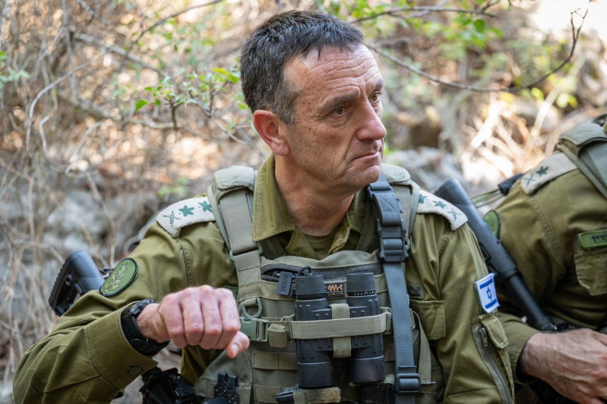

## Message 11803

דובר צה״ל: 

הרמטכ״ל בתרגיל בצפון: ״אנחנו לא עוצרים. המטוסים תוקפים כל היום, ואנחנו מתכוננים לתמרון״

הרמטכ״ל, רב-אלוף הרצי הלוי, ביקר היום (ד׳) בתרגיל החטיבתי של חטיבה 7 בגבול הצפון, עם מפקד פיקוד הצפון, מפקד אוגדה 98, מפקד המרכז לאימונים ביבשה, מפקד חטיבה 7 ומפקדים נוספים.

