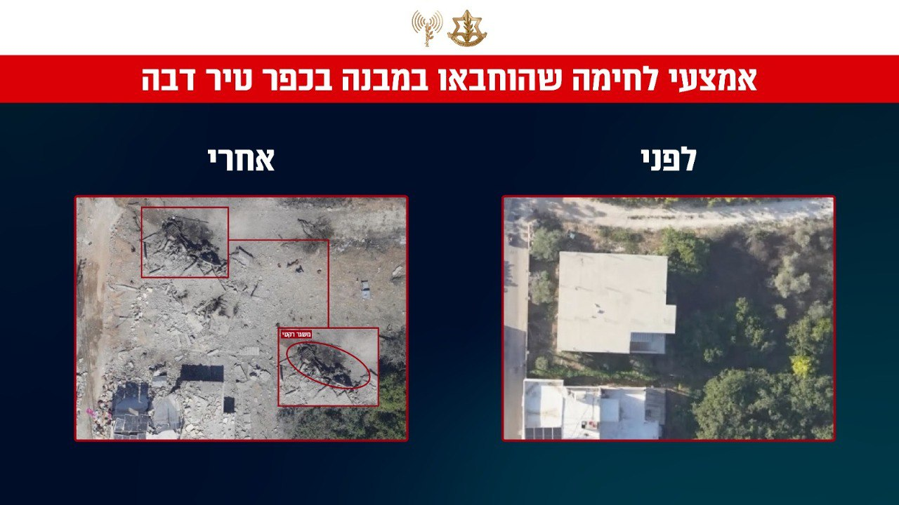

## Message 11814

דובר צה״ל:

כך נראים הכפרים בלבנון: שרידי המשגרים מתקיפות צה"ל בימים האחרונים

בתיעודים מהימים האחרונים, ניתן לראות את השרידים של משגרים אותם החביא חיזבאללה בבתים של אזרחים אותם תקפנו במסגרת מבצע "חיצי הצפון". אמצעי השיגור הושמדו. עד כה הותקפו למעלה מ-2000 מטרות ובהן תשתיות טרור ואמצעי לחימה רבים שהוחבאו בבתים של אזרחים, כחלק משיטת הפעולה של ארגון הטרור חיזבאללה המשתמש בתושבי לבנון כמגן אנושי.  

צה"ל מתחקר את תוצאות התקיפה, וממשיך לדייק את התקיפות בהמשך, לאתר ולתקוף נכסים צבאיים ואמצעי לחימה של חיזבאללה. צה"ל גורע ופוגע בתשתיות וביכולות הצבאיות של חיזבאללה.

