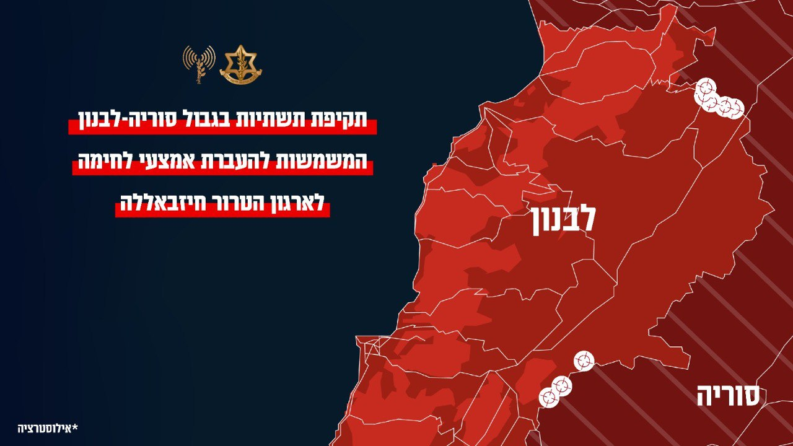

## Message 11827

דובר צה"ל:

צה"ל תקף תשתיות המשמשות להעברת אמצעי לחימה משטח סוריה לחיזבאללה בלבנון

מטוסי קרב של חיל האוויר תקפו לפני זמן קצר תשתיות בגבול סוריה-לבנון, המשמשות את ארגון הטרור חיזבאללה להעברת אמצעי לחימה משטח סוריה לידי חיזבאללה בלבנון. חיזבאללה משתמש באמצעי הלחימה הללו נגד אזרחי מדינת ישראל. 

צה"ל פועל בנחישות למניעת כניסת אמצעי לחימה ללבנון ולהתחמשות חיזבאללה.

בשעה זו צה"ל ממשיך לתקוף בעוצמה לפגיעה ולגריעת היכולות והתשתיות הצבאיות של ארגון הטרור חיזבאללה.

