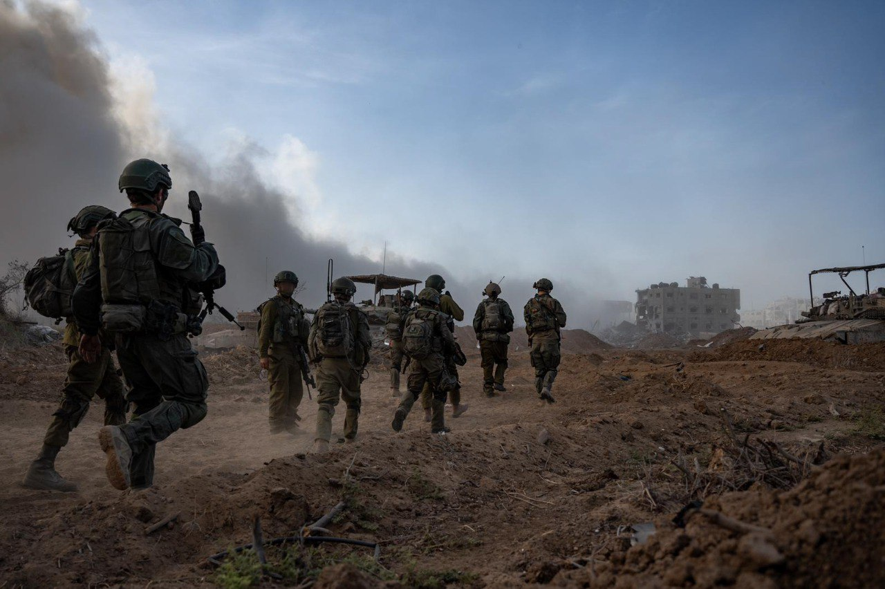

## Message 11835

הודעה משותפת לדובר צה״ל ודוברות שב״כ:

צה"ל ושב"כ ממשיכים בחיסולים ממוקדים ברצועת עזה. חוסלו מחבלים שלקחו חלק במתקפת הטרור הרצחנית ליישובי העוטף ב-7 באוקטובר 

בשבוע האחרון, בפעילות משותפת של צה״ל ושב״כ, כלי טיס של חיל האוויר תקף ברפיח וחיסל את המחבל סלימאן ג׳ואד סלימאן אבו לאפי. סלימאן קידם העברות של אמצעי לחימה לרצועת עזה והכווין מרצועת עזה פיגועים באיו"ש. בתקיפה חוסל גם אחיו של סלימאן, עבדאללה אבו לאפי, מחבל בארגון הטרור הג׳יהאד האסלאמי.

מטוסי קרב של חיל האוויר, בהכוונת שב״כ וחטיבת האש 215 חיסלו בתקיפות ממוקדות מפקד כוח נוחבה של ארגון הטרור חמאס ומחבל שלקח חלק במתקפת הטרור הרצחנית ליישובי העוטף ב-7 באוקטובר.

כוחות אוגדה 162 ממשיכים לפעול במרחב רפיח, וביממה האחרונה הכוחות חיסלו כ-15 מחבלים.

