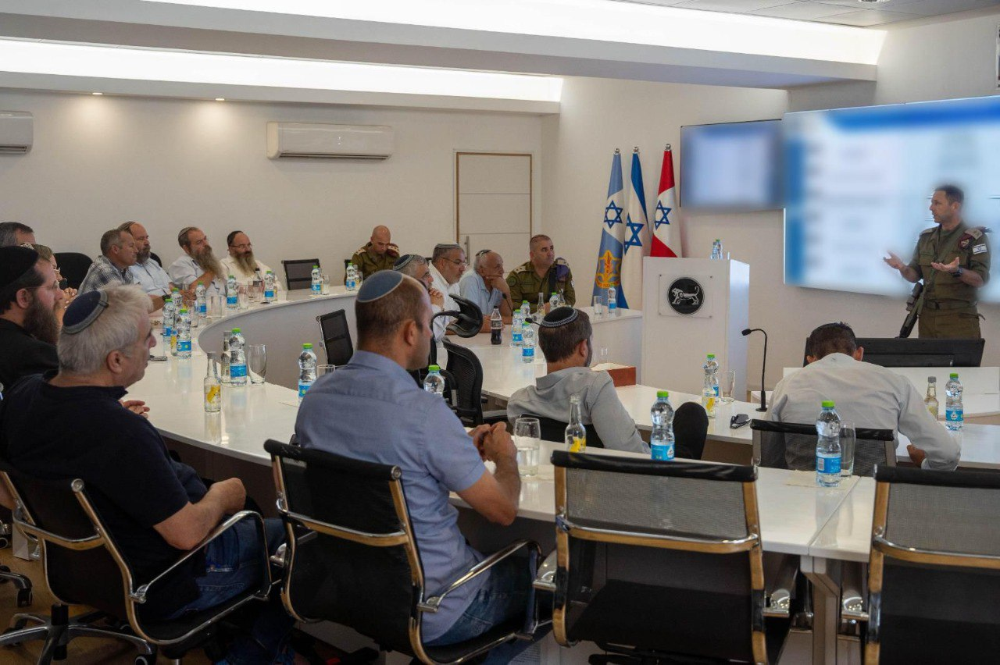

## Message 11849

דובר צה"ל:

מפקד פיקוד המרכז נפגש עם ראשי הרשויות לקראת החגים

מפקד פיקוד המרכז, אלוף אבי בלוט נפגש אתמול (ד') עם ראשי הרשויות בגזרת הפיקוד בהשתתפות מפקד אוגדת איו"ש, תת-אלוף יקי דולף, מפקד מג"ב איו"ש, תת-ניצב ברק מרדכי, ראש מטה פיקוד המרכז, תת-אלוף רועי שטרית, ראש מנהלת קשת צבעים, תת-אלוף עופר הינדי, קצין ההגמ"ר הפיקודי, סגן-אלוף אליצור טרבלסי ומפקדים נוספים.

במפגש הוצגו הפעולות האחרונות בגזרה, תמונת המצב המבצעית והיערכות הכוחות לקראת החגים והתרחישים השונים.

מדברי מפקד פיקוד המרכז, אלוף אבי בלוט: "מאז האסון הגדול שפקד אותנו בשבעה באוקטובר, אנו, לובשי המדים, עושים הכל כדי לתקן ולהשיב את האמון שאבד באותו יום. בתוך כך, בזמן שאנחנו מדברים, לוחמי צה"ל ומג"ב פועלים בג'נין כחלק ממבצעי המשך אליהם יצאנו בשבועות האחרונים. צה״ל הרים הילוך בכל הזירות. יש לי תקווה שמתוך המשבר שאנו חווים נעמוד במטרות המלחמה שהוצבו לנו, ניצור ביטחון ונעשה דברים גדולים".

