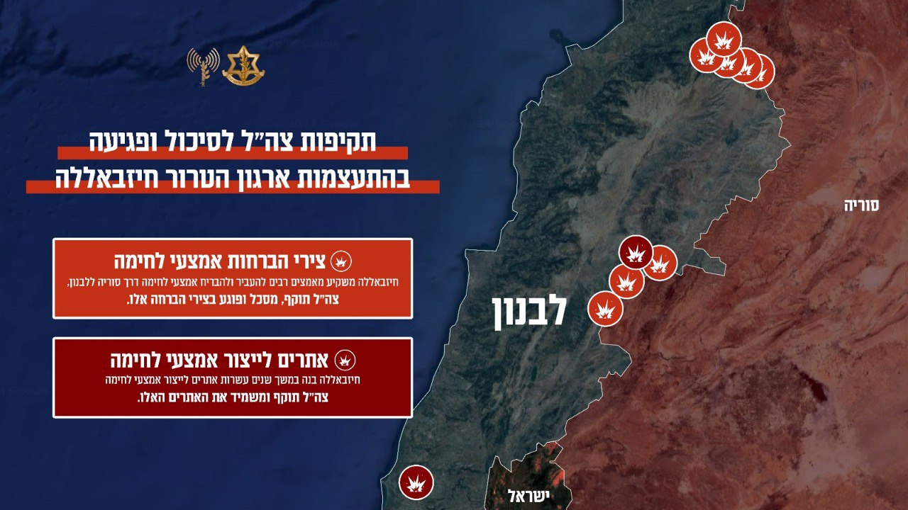

## Message 11919

דובר צה"ל:

פגיעה ביכולת ההתעצמות: צה"ל תקף אתרי ייצור של חיזבאללה וצירי הברחה על גבול סוריה-לבנון

ארגון הטרור חיזבאללה פועל שנים רבות באופן שיטתי להתעצם על מנת להגדיל את מאגר אמצעי הלחימה שנמצאים ברשותו. 
כחלק משיטה זו, אמצעי לחימה ורכיבים מועברים ממזרח לשטח לבנון ומובאים לאתרי ייצור, שם יוצרים מגוון אמצעי לחימה, ביניהם טילים מדויקים שנועדו לפגוע במדינת ישראל.

במהלך הלילה בהכוונה מדויקת של אגף המודיעין, צה"ל העמיק את הפגיעה ביכולת ההתעצמות באמצעות רצף תקיפות מדוייק על אתרי ייצור מרכזיים של חיזבאללה, ביניהם אתר ייצור והרכבה של משגרי רקטות וטילים בדרום לבנון ואתר נוסף שהיה מיועד לשמש חלק מפרויקט ההתעצמות של ארגון הטרור חיזבאללה בבקעא.

זאת לאחר רצף תקיפות שאירעו מוקדם יותר השבוע (חמישי) כנגד מספר צירי ההברחה המשמשים להעברת אמצעי לחימה משטח סוריה ללבנון.

צה"ל ממשיך לפעול בעוצמה לגריעת יכולתיו של ארגון הטרור חיזבאללה, המאיימות על אזרחי מדינת ישראל והאזור כולו.

