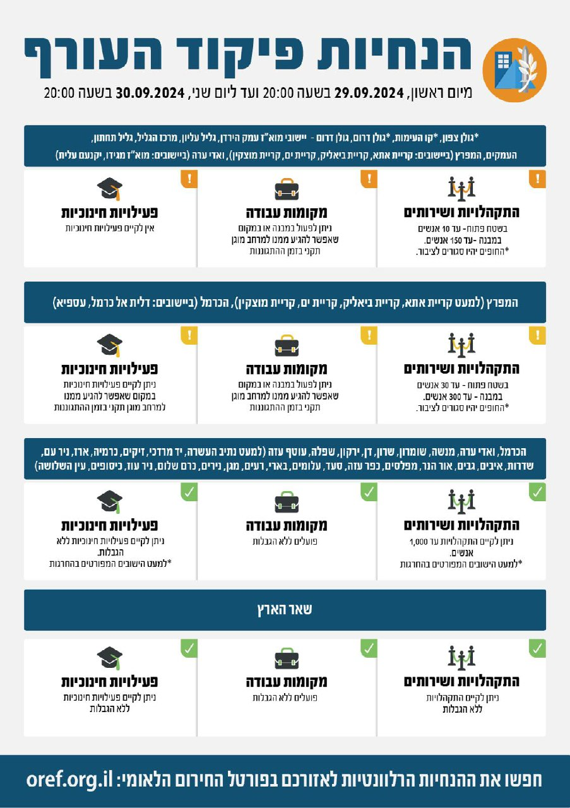

## Message 11954

דובר צה"ל:

שינויים במדיניות ההתגוננות של פיקוד העורף:

בתום הערכת המצב הוחלט כי החל מהערב (א׳) יבוצע שינוי במדיניות ההתגוננות של פיקוד העורף. 

במסגרת השינויים הוחלט על הקלות באזורי הנחיה המפרץ (למעט הקריות) וביישובים דאלית אל כרמל ועספייא בכרמל - מעבר ממדרג פעילות מצומצת למדרג פעילות חלקית, המאפשר פעילויות חינוכיות במקום שאפשר להגיע ממנו למרחב מוגן תקני בזמן ההתגוננות. כמו כן יותרו ביישובים הנ"ל התקהלויות ושירותים באופן מוגבל - בשטח פתוח עד 30 ובמבנה עד 300 איש.

יש להמשיך ולעקוב אחר ההנחיות המפורסמות על ידי פיקוד העורף באמצעי ההפצה הרשמיים. 
ההנחיות המלאות מעודכנות בפורטל החירום הלאומי וביישומון פיקוד העורף.

