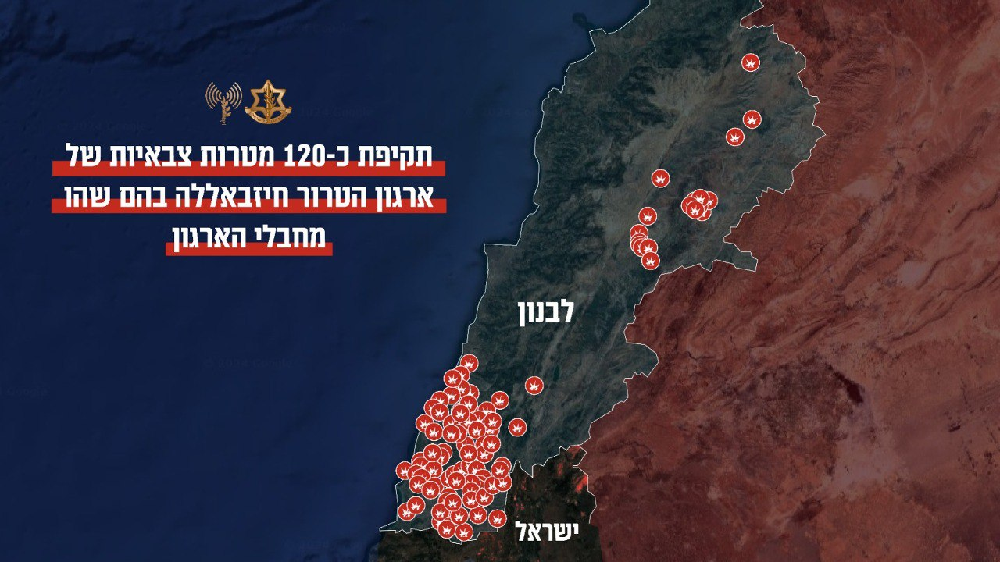

## Message 11958

דובר צה"ל:

צה"ל השלים שורת תקיפות רחבה על מפקדות צבאיות של ארגון הטרור חיזבאללה

לפני זמן קצר, צה״ל יצא לתקיפה נרחבת של מטרות צבאיות של ארגון הטרור חיזבאללה בהם שהו מחבלי הארגון.

במסגרת התקיפה, עשרות רבות של מטוסי קרב, בהכוונת אגף המודיעין, פיקוד הצפון וחיל האוויר, תקפו כ-120 מטרות צבאיות של ארגון הטרור חיזבאללה במרחבים בדרום ועומק לבנון.

בין הנכסים שהותקפו, מפקדות משמעותיות של יחידות שונות מהארגון, מבנים צבאיים ותשתיות רבות אשר מהן מחבלי חיזבאללה תכננו וביצעו מתווי טרור כנגד מדינת ישראל.

התקיפה מהווה פגיעה משמעותית נוספת בכשירות הארגון, ביכולות הפיקוד והשליטה שלו ובהתנהלותו בחירום.

