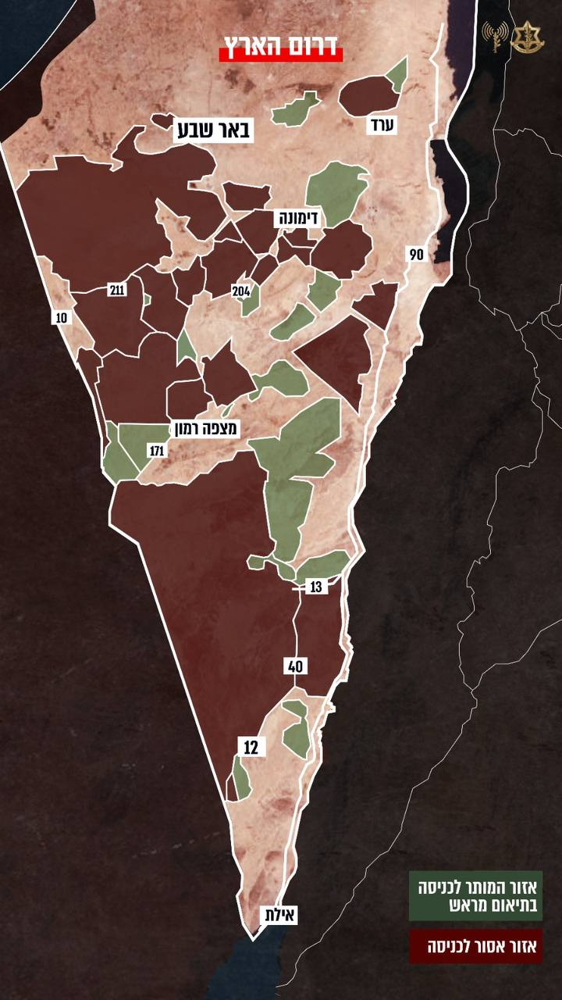

## Message 11972

דובר צה״ל:

בהתאם להערכת במצב ובשל המצב המבצעי, צה"ל ממשיך להתאמן בשטחי האש בדרום הארץ גם במהלך חגי תשרי. 
לאור זאת, מרבית שטחי האש ייסגרו לכניסת מטיילים.
יחד עם זאת, תתאפשר כניסת מטיילים בדרום הארץ לחלק משטחי האש.
השטחים המותרים והאסורים לכניסה מסומנים במפה המצורפת.

בנוסף, כחלק מהערכת המצב, הוחלט כי השנה צה״ל לא ייפתח את ציר 10 למטיילים בתקופה זו.

צה"ל מבקש מהציבור לא להיכנס למרחבים האסורים, ולאפשר לכוחות הביטחון להמשיך ולבצע את משימותיהם.
כל הגעה לשטח צבאי מצריכה תיאום ואישור מראש. הגעה לשטח צבאי ללא תיאום ואישור מראש מסכנת את ביטחון המטיילים.

כניסת מטיילים לשטחים המותרים
תתאפשר בתיאום של לפחות שלושה ימים מראש. 
להלן, מספרי הטלפון לתיאום ובירור טיולים בדרום הארץ: 
 08-9902926/8
0529010563 (סמס בלבד)

מצורפת מפת המגבלות בשטחי האש בדרום הארץ במהלך חגי תשרי:

