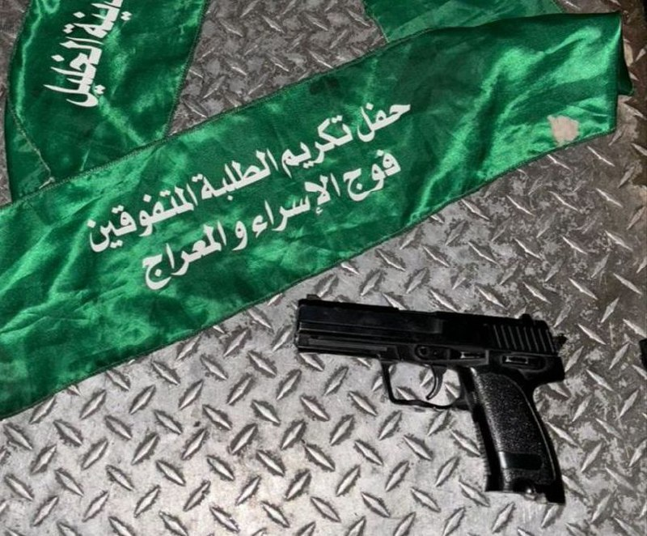

## Message 11980

דובר צה"ל:

כוחות צה״ל, שב״כ ומג״ב פעלו הלילה בשש חטיבות מרחביות במקביל, עצרו יותר מ-20 מבוקשים ופתחו הלילה במבצעים בשכם ובסילוואד

כוחות צה״ל, שב״כ ומג״ב החלו הלילה בשני מבצעים בשכם שבחטיבת שומרון ובכפר סילוואד שבחטיבת בנימין. עד כה, הכוחות עצרו מספר מבוקשים החשודים בפעילות טרור וממשיכים לפעול לסיכול טרור גם בשעה זו.

בפעילות כוחות הביטחון הלילה ברחבי יהודה ושומרון, נעצרו יותר מ-20 מבוקשים החשודים בפעילות טרור. בחברון ובתפוח שבחטיבת יהודה הלוחמים איתרו אקדח, עצרו מבוקש והחרימו חומרי הסתה של ארגון הטרור חמאס. 

בקלקיליה ובחארס שבחטיבת אפרים הכוחות עצרו שמונה מבוקשים, בחטיבת עציון נעצרו שבעה מבוקשים ובטולכרם שבמנשה נעצר מבוקש נוסף החשוד בפעילות טרור. 

המבוקשים שנעצרו ואמצעי הלחימה שהוחרמו הועברו להמשך טיפול כוחות הביטחון, אין נפגעים לכוחותינו.

עד כה נעצרו מתחילת המלחמה מעל 5,250 מבוקשים ברחבי פיקוד המרכז, יותר מ-2,050 מהם משויכים לארגון הטרור חמאס.

