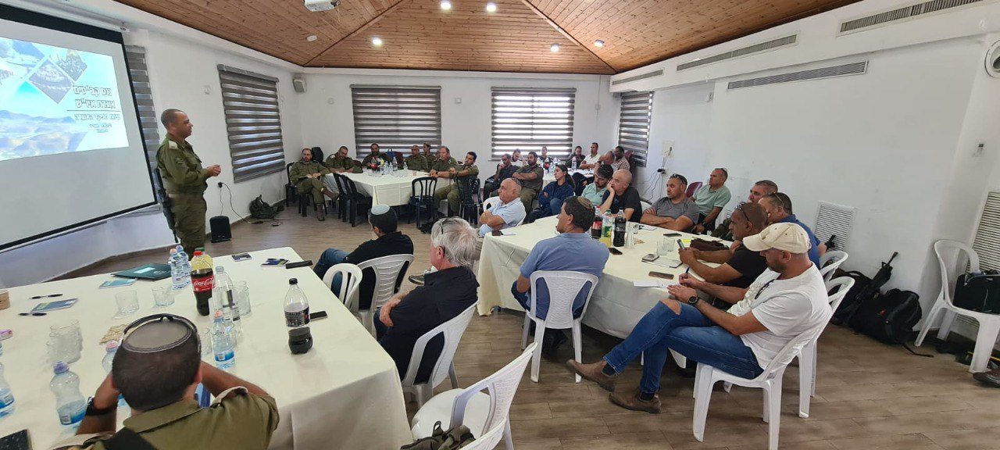

## Message 11988

דובר צה"ל:

מפקד אוגדת יהודה ושומרון, תת-אלוף יקי דולף במפגש עם קב"טים וכוחות הביטחון האזרחיים האוגדתיים: "עשרות שנים לא פעלו בגזרה כמו שהכוחות פועלים עכשיו"

מפקד אוגדת איו"ש, תת-אלוף יקי דולף נפגש אתמול (א׳) עם הקב״טים וכוחות הביטחון האזרחיים בגזרת האוגדה.
המפגש התקיים בהובלת הגמ״ר איו״ש ומועצת יש״ע והתמקד בהצפת בעיות, פתרונות וסיכום השנה החולפת בהיבטי שיפור ההגנה ביישובים בגזרת האוגדה. 

מדברי מאו"ג איו"ש, תת-אלוף יקי דולף: "עשרות שנים לא פעלו בגזרה כמו שהכוחות פועלים עכשיו - לא בקצב המבצעים, החיסולים האוויריים, המעצרים והמחבלים המחוסלים. אנחנו חייבים לעשות את זה ביחד, כל גופי הביטחון ביחד עם כוחות הביטחון האזרחיים. עשינו עבודה משותפת ומאומצת ביחד לשיפור תשתיות, צירים, גיוס הגמ"ר והצטיידות באמצעי לחימה. הרוח הגבית שכוחות הביטחון האזרחיים נותנים לנו מאפשרת מרחב רחב יותר לפעולות ההתקפיות שמתקיימות בגזרה".

