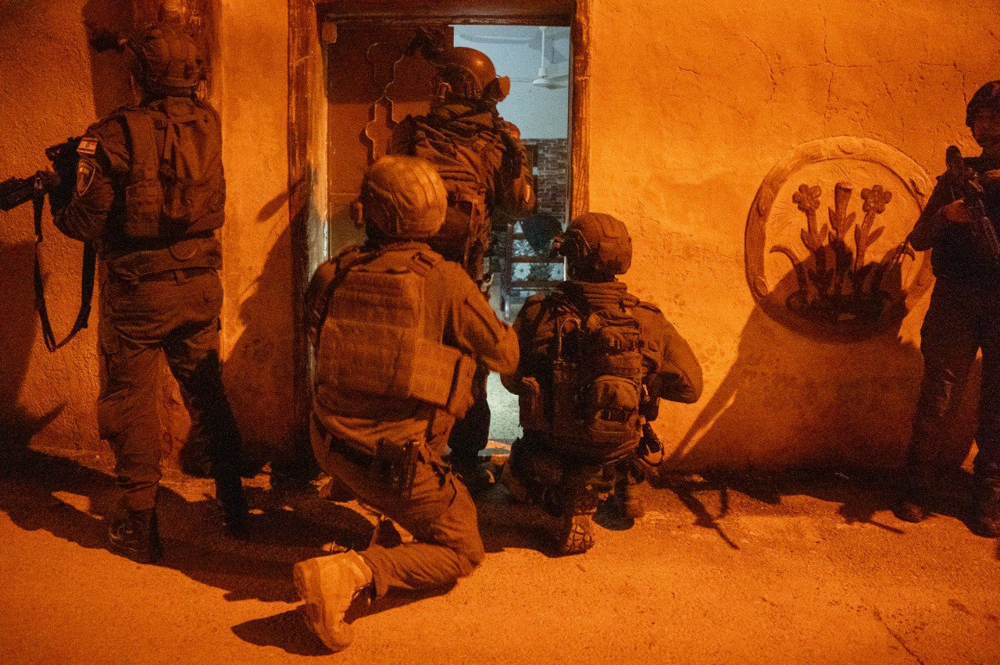

## Message 14731

דובר צה"ל:

כוחות הביטחון הרסו את דירתו של המחבל מוחמד אבו יאסין, שלקח חלק בפיגוע בו נפל רס״ל (מיל׳) אלחנן אריאל קליין ז״ל ונפצעו ארבעה לוחמי מג״ב

כוחות צה״ל, שב״כ ומג״ב פעלו הלילה בכפר בלעא שבחטיבת מנשה והרסו את דירתו של המחבל מוחמד אבו יאסין. 

אבו יאסין היה חלק מחוליית המחבלים שביצעה בתאריך 2 בנובמבר 2023 פיגוע טרור בצומת בית ליד, בו נפל רס"ל (מיל') אלחנן אריאל קליין ז"ל, ונפצעו ארבעה לוחמי מג"ב.

