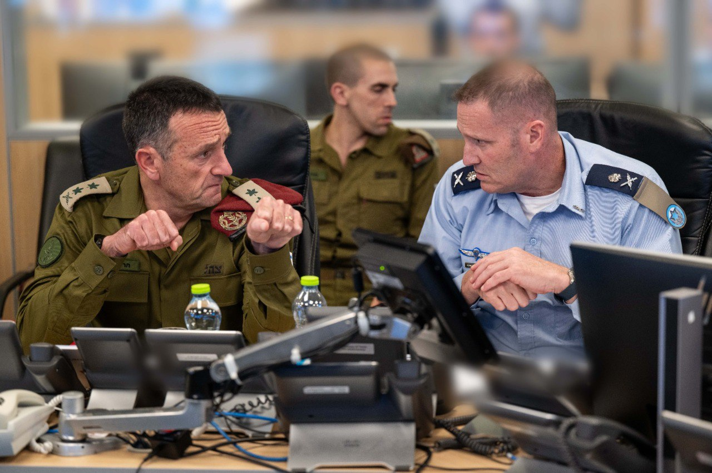

## Message 14739

הרמטכ״ל על מבצע הפשיטה על מתקן הטילים בסוריה: ״הפעולה של יחידת שלדג בעומק סוריה מצטרפת לשורה של פעולות נועזות שצה״ל ביצע בחודשים האחרונים מרצועת עזה, אל הדאחייה בביירות ועד איראן במטרה להשמיד את יכולות ייצור הטילים של הציר האיראני. איראן ביססה במשך שנים מעגל אש וטילים בגבולות מדינת ישראל, ואנחנו פגענו גם במעגל וגם בראש״

