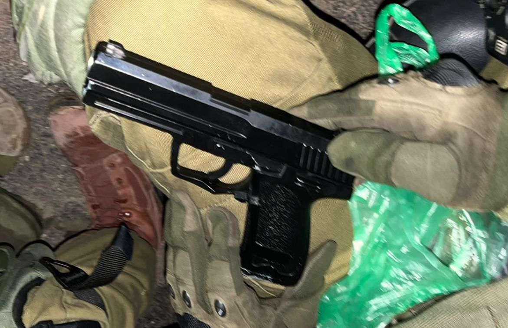

## Message 14751

42 מבוקשים נעצרו, ארבעה כלי נשק ועשרות אלפי שקלים כספי טרור הוחרמו: פעילות כוחות הביטחון בפיקוד המרכז השבוע 

כוחות הביטחון פעלו במהלך השבוע לסיכול טרור ביעדים רבים ברחבי פיקוד המרכז.

במסגרת הפעילות הכוחות עצרו 42 מבוקשים החשודים בפעילויות טרור והחרימו במהלך השבוע ארבעה כלי נשק ועשרות אלפי שקלים של כספי טרור.

המבוקשים שנעצרו ואמצעי הלחימה שהוחרמו הועברו להמשך טיפול כוחות הביטחון.

