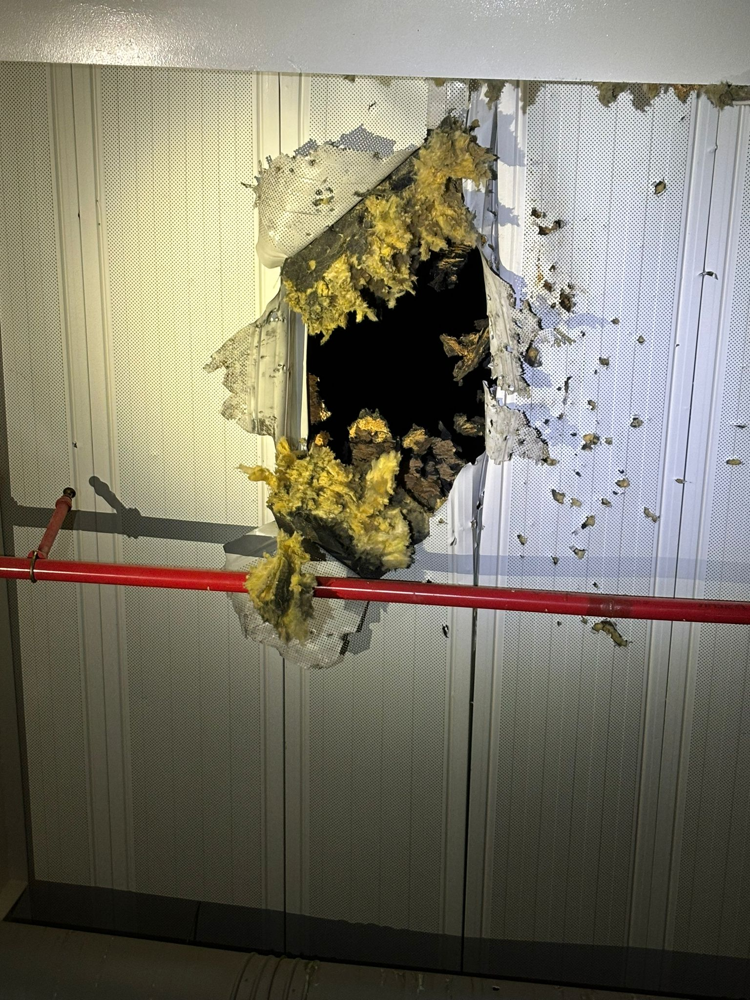

## Message 14777

דובר צה"ל:

בהמשך להודעה על השיגור שנפל במרחב מעבר ארז, זוהו פגיעות במרחב אשר גרמו לנזק למרחב המעבר ובסמוך למתחם מעבר משאיות הסיוע ההומניטרי. 

נדגיש כי החל מתחילת חודש דצמבר הועברו לרצועת עזה יותר מ-1,200 משאיות סיוע הומניטרי דרך מעבר ארז של רשות המעברים במשרד הביטחון הכוללות: מזון, מים, ציוד רפואי וציוד למחסות. 

ארגון הטרור חמאס ממשיך להפר באופן בוטה את הדין הבין-לאומי, תוך שימוש ציני במרכזים אזרחיים למימוש פעולות טרור. צה"ל באמצעות המתפ"ש ימשיך לפעול בהתאם לדין הבינלאומי על מנת לאפשר ולהקל על המענה ההומניטרי לתושבי רצועת עזה.

