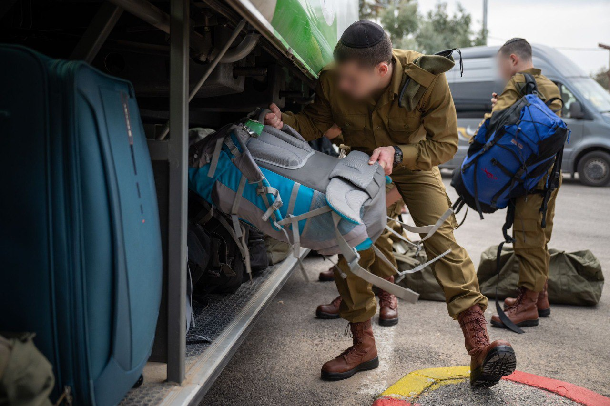

## Message 14793

דובר צה״ל:

מחזור הגיוס הראשון לחטיבה החרדית "החשמונאים" יוצא לדרך

כ-50 מתגייסים חרדים ראשונים כבר חוילו והם יהוו את הגרעין להקמת הפלוגה הראשונה בחטיבה. בנוסף, עד סוף היום יושלם חיולם של כ-100 חרדים שיתגייסו בשירות מילואים מהמגזר החרדי ויתחילו הכשרת חי״ר רובאי 07 במשך כחצי שנה, בסיומה יהוו חלק מפלוגת המילואים הראשונה של החטיבה.
כמו כן, במהלך החודש יתקיימו מספר גיוסים מאספים ומתגייסים בגיוסים אלו יצטרפו למהלך הטירונות.

שתי הפלוגות שהתגייסו היום הן יריית הפתיחה הראשונה בתהליך הקמת החטיבה החרדית, שהיא אבן דרך משמעותית בתהליך הרחבת שירות בני המגזר החרדי בצה״ל בייחוד על-רקע הצורך המבצעי הנובע מצרכי המלחמה.

לקראת פתיחת החטיבה נעשה תהליך הכנה רחב היקף לרבות איתור סגלים והכנתם, התאמת המדיניות, שיפוץ בסיס ההכשרה והתאמה לאורח החיים החרדי.

במהלך היום, מתקיים גם גיוס של מלש"בים נוספים מבני הציבור החרדי למגוון מסלולים נוספים שנפתחו למען שילובם בצה״ל.

