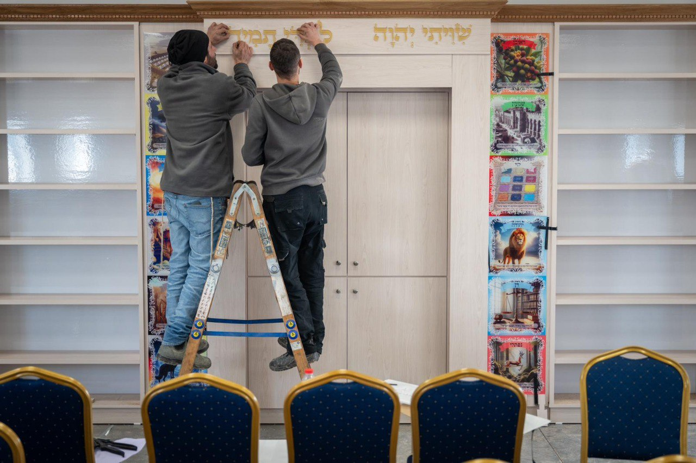

## Message 14801

דובר צה״ל:

תיעוד מתוך ההיערכות וההכנות של צה"ל לגיוס החרדים

כחלק מתהליך הגיוס, ובמסגרת המהלכים להגברת האיוש ולחיזוק כשירות היחידות, צה״ל, בהובלת אגף כוח האדם, ממשיך ומשלים בימים אלה את הגיוסים למערך הלחימה וליתר המערכים, לרבות גיוס בני המגזר החרדי.

היום גויס המחזור הראשון לחטיבת "החשמונאים"- גרעין ראשון לפלוגה הסדירה וגרעין ראשון לפלוגת המילואים.
מפקדי החטיבה ביצעו תהליך הכנה ארוך ומשמעותי לרבות הכנת סגל ייחודית. 
כמו כן, בסיס החטיבה במחנה ״תבץ״ עבר בחודשים האחרונים שיפוצים ושדרוג תשתיות לטובת הקמת החטיבה. 
בין היתר הוקמו בתי כנסת, מגורים לכלל הפלוגות העתידות ותשתיות מותאמות למגזר החרדי.

בנוסף, לראשונה, היום גויסו מלש״בים מהמגזר החרדי למסלול חדש באגף הטכנולוגיה והלוגיסטיקה. במסגרת המסלול, ישרתו המתגייסים בתפקידים במערך האלקטרו-אופטי של מרכז השיקום והאחזקה ויסייעו בייצור הרכיבים שהצורך בהם הוגבר משמעותית בעקבות המלחמה.

