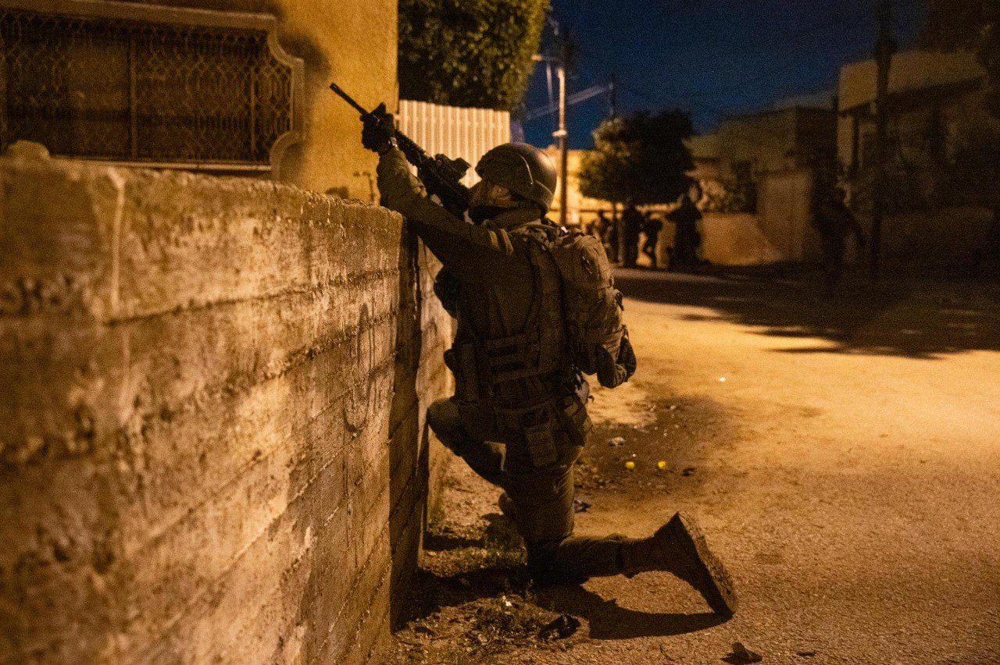

## Message 14827

דובר צה"ל:

שלושה מחבלים חוסלו, 18 מבוקשים נעצרו ומבצע חטיבתי החל בחטיבת הבקעה והעמקים, כוחות הביטחון המשיכו בפעילות ההתקפית במהלך הלילה בפיקוד המרכז

כוחות הביטחון החלו הלילה במבצע חטיבתי בחטיבת הבקעה והעמקים, במהלך המבצע זוהתה חוליית מחבלים חמושה שירתה לעבר הכוחות במרחב טמון, כלי טיס של חיל האוויר תקף וחיסל שני מחבלים חמושים. בנוסף, הוחרמו אמצעי לחימה ונעצרו מספר מבוקשים.

כוחות הביטחון פעלו במהלך הלילה לסיכול טרור במספר יעדים בפיקוד המרכז.

בכפר טלוזה שבחטיבת שומרון, הלוחמים חיסלו מחבל בקרב פנים אל פנים, החרימו כלי נשק מסוג ״קלאצ׳ניקוב" ועצרו מבוקש. ברפידיה שבגזרת החטיבה עצרו הכוחות שני מבוקשים והחרימו נשק מסוג קרלו.
בחטיבת יהודה הכוחות החרימו שלושה כלי נשק ועצרו מבוקש אחד, בחטיבת עציון נעצרו שמונה מבוקשים, בחטיבת אפרים הכוחות עצרו שלושה מבוקשים ובחטיבת בנימין נעצרו חמישה מבוקשים.

במהלך חילופי האש בטלוזה, לוחם במילואים בגדוד 7037, חטיבת שומרון, נפצע באורח קשה. הלוחם פונה לקבלת טיפול רפואי בבית חולים, משפחתו עודכנה.

