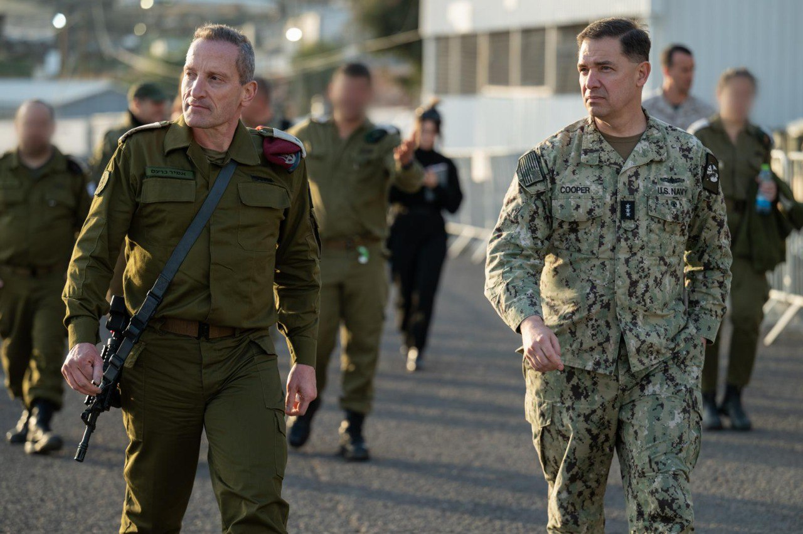

## Message 14837

דובר צה״ל: 

סגן מפקד פיקוד המרכז בצבא ארה"ב (CENTCOM), אדמירל (***) בראד קופר נחת בשבוע שעבר (ה׳) בישראל לביקור כאורחו הרשמי של סגן ראש המטה הכללי, אלוף אמיר ברעם. 

סגן הרמטכ״ל וסגן מפקד סנטקום ביקרו במספר בסיסי חיל האוויר, בין היתר בבסיס ״נבטים״, שם התקיימה סקירת יכולות והצגת הפעולות האופרטיביות המשותפות בין הצבאות. 
כמו כן, נערך שיח משותף אודות הפעילות למול האיומים מתימן ושיתוף הפעולה עם צבא ארצות הברית במעטפת ההגנה הכוללת על מדינת ישראל והמזרח התיכון.
בהמשך, שמעו סקירה אסטרטגית בראשות ראש מטה חיל האוויר, תת-אלוף עומר טישלר, מפקד בסיס נבטים ומפקדים נוספים. 

בנוסף, סגן הרמטכ״ל וסגן מפקד סנטקום ביקרו באוגדה 80, שם הוצגו עיקרי העשייה המבצעית, השתנות האויב בגבולות וגורמי הכוח המשפיעים בגזרה.
 
כחלק מהביקור התקיימה הערכת מצב משותפת בדגש על מעגל שני ושלישי.

המפקדים ביקרו גם בפיקוד הצפון, קיימו סקירת מצב משותפת ונפגשו עם גורמים ממנגנון האכיפה המשותף. 

צה"ל ימשיך להעמיק את הקשר עם צבא ארצות הברית מתוך מחויבות לחיזוק היציבות האזורית והתיאום בין הצבאות.

