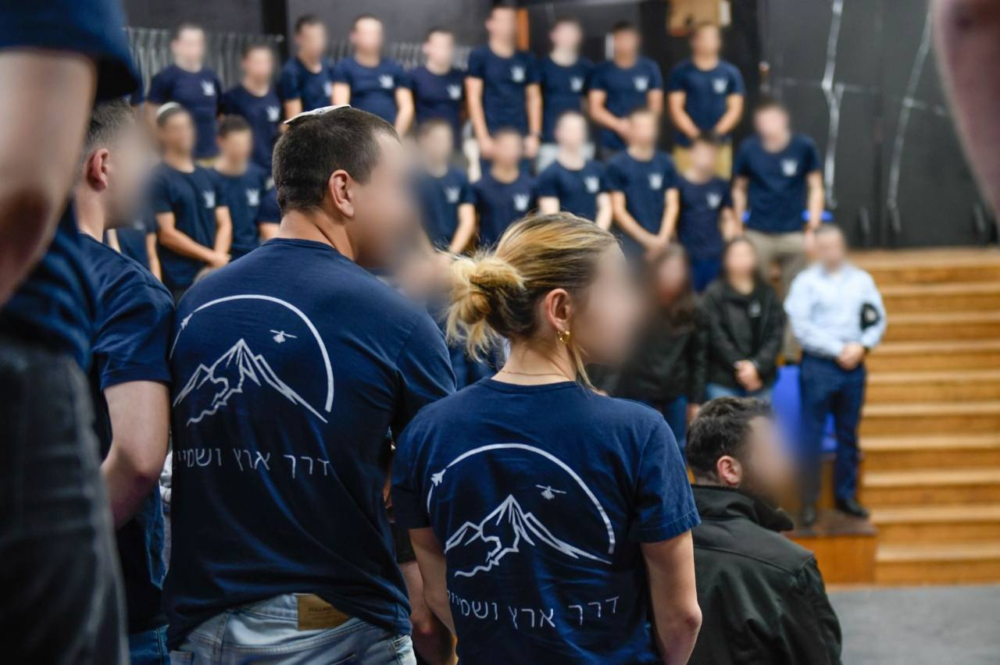

## Message 14869

דובר צה"ל:

המכינה הראשונה לטיס של חיל האוויר, "דרך ארץ ושמיים", סיימה את המחזור הראשון שלה אתמול (ד'). המכינה נועדה לסייע לחניכי קורס הטיס בהתמודדות עם אתגריו הייחודיים. 

המחזור הסתיים לאחר כ-9 שבועות, במהלכם עברו החניכים תכנים מעולם חיל האוויר במטרה לספק הכנה מנטלית וחברתית. מסיימי המכינה צפויים להתגייס לקורס הטיס הקרוב.

מדברי ראש להק כוח אדם בחיל האוויר, תת-אלוף יובל הראל: "המטרה של השבועות האחרונים הייתה להבהיר לכם דבר אחד מאוד פשוט- אתם, אנשים רגילים, יכולים להגשים חלומות גדולים אם רק תרצו. המכינה הזאת היא הגשמת חלום מבחינתי, מכינה שלוקחת את הדבר הגדול והמפחיד שנקרא קורס טיס ומקרקעת אותו. מכינה שתכליתה לתת הזדמנות הוגנת ושווה לכל נער ונערה בחברה הישראלית לעמוד על מגרש המסדרים. אנחנו רק בתחילת הדרך, נלמד, נתחקר ונשתפר אבל עשינו את הצעד החשוב ביותר בדרך להגשמה".

